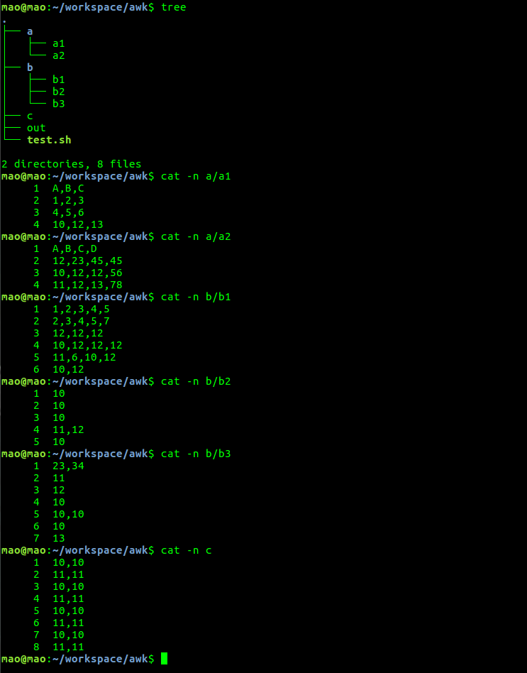
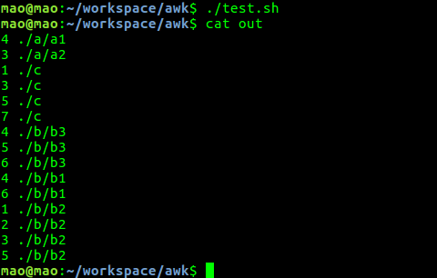

## Linux命令

收集linux相关命令,包含文件,网络,性能,编辑等.

<!--more-->

### 文件相关

- 建立软链接，快速启动软件（不用修改环境变量）

```sh
ss@ss:/usr/bin$ sudo ln -s /opt/pycharm/bin/pycharm.sh pycharm
```

- 查看文件行数

```sh
wc -l filename #就是查看文件里有多少行,wc -l *.csv ==>列出所有csv文件行数
wc -w filename #看文件里有多少个word。
wc -L filename #文件里最长的那一行是多少个字
```

- 查看文件的前/后 n 行

```sh
head -n "文件名"
tail -n "文件名"
```

- 用dd生成指定大小的文件

```sh
#生成5GB数据
dd if=/dev/zero of=tmp bs=1G count=5
```

- 查看当前文件夹下文件的总个数

```sh
ls -l | grep "^-" | wc -l
```

- 重命名文件

```
# 将文件名中包含A的文件名全部替换为B
rename "s/A/B/" *
```

- lsof

```sh
# 1.列出所有打开的文件:
lsof
备注: 如果不加任何参数，就会打开所有被打开的文件，建议加上一下参数来具体定位
# 2. 查看谁正在使用某个文件
lsof   /filepath/file
# 3.递归查看某个目录的文件信息
lsof +D /filepath/filepath2/
备注: 使用了+D，对应目录下的所有子目录和文件都会被列出
# 4. 比使用+D选项，遍历查看某个目录的所有文件信息 的方法
lsof | grep ‘/filepath/filepath2/’
# 5. 列出某个用户打开的文件信息
lsof  -u username
备注: -u 选项，u其实是user的缩写
# 6. 列出某个程序所打开的文件信息
lsof -c mysql
备注: -c 选项将会列出所有以mysql开头的程序的文件，其实你也可以写成lsof | grep mysql,但是第一种方法明显比第二种方法要少打几个字符了
# 7. 列出多个程序多打开的文件信息
lsof -c mysql -c apache
# 8. 列出某个用户以及某个程序所打开的文件信息
lsof -u test -c mysql
# 9. 列出除了某个用户外的被打开的文件信息
lsof   -u ^root
备注：^这个符号在用户名之前，将会把是root用户打开的进程不让显示
# 10. 通过某个进程号显示该进行打开的文件
lsof -p 1
# 11. 列出多个进程号对应的文件信息
lsof -p 123,456,789
# 12. 列出除了某个进程号，其他进程号所打开的文件信息
lsof -p ^1
# 13 . 列出所有的网络连接
lsof -i
# 14. 列出所有tcp 网络连接信息
lsof  -i tcp
# 15. 列出所有udp网络连接信息
lsof  -i udp
# 16. 列出谁在使用某个端口
lsof -i :3306
# 17. 列出谁在使用某个特定的udp端口
lsof -i udp:55
特定的tcp端口
lsof -i tcp:80
# 18. 列出某个用户的所有活跃的网络端口
lsof  -a -u test -i
# 19. 列出所有网络文件系统
lsof -N
# 20.域名socket文件
lsof -u
# 21.某个用户组所打开的文件信息
lsof -g 5555
# 22. 根据文件描述列出对应的文件信息
lsof -d description(like 2)
# 23. 根据文件描述范围列出文件信息
lsof -d 2-3
```

- 解压（路径中含有空格）

```sh
#/usr/bin env
# 解压路径下有空格，将空格首先替换为“问好”，注意shell等号前后没有空格
files=$(find ./files/ -type f | tr " " "?")
for i in ${files}
do
echo "$i"
unzip "$i"
done
```


### 网络相关

- 连接远程服务器

```sh
ssh tm@172.16.18.24
# 之后会提醒输入密码
```

- 远程上传文件，下载文件命令

```sh
# 下载
scp -r username@192.168.0.1:/home/username/remotefile.txt
# 上传
scp -r localfile.txt username@192.168.0.1:/home/username/
```

- 开通ssh服务

```sh
# 查看是否开启了ssh服务是否安装,使用命令：
sudo ps -e |grep ssh
# 先更新资源列表，使用命令：
sudo apt-get update
# 安装openssh-server，使用命令：
sudo apt-get install openssh-server
# 启动ssh命令
service sshd start
# 停止ssh命令
service sshd stop
```

- ssh免密

```sh
# 本地执行:
ssh-keygen -t rsa
# 
ssh-copy-id -i ~/.ssh/id_rsa.pub tm@172.16.18.39
```

- tcpdump抓包，指定网卡，指定端口，指定host,写到test.pcap

```sh
tcpdump -i ens7f0 port 10080 and host 192.168.126.3 -w test.pcap
```

- Ubuntu <a href="https://mirrors.tuna.tsinghua.edu.cn/help/ubuntu/">镜像使用帮助</a>

```sh
# Ubuntu 的软件源配置文件是 /etc/apt/sources.list。将系统自带的该文件做个备份，将该文件替换为下面内容，即可使用 TUNA 的软件源镜像。
# 默认注释了源码镜像以提高 apt update 速度，如有需要可自行取消注释
deb https://mirrors.tuna.tsinghua.edu.cn/ubuntu/ xenial main restricted universe multiverse
# deb-src https://mirrors.tuna.tsinghua.edu.cn/ubuntu/ xenial main restricted universe multiverse
deb https://mirrors.tuna.tsinghua.edu.cn/ubuntu/ xenial-updates main restricted universe multiverse
# deb-src https://mirrors.tuna.tsinghua.edu.cn/ubuntu/ xenial-updates main restricted universe multiverse
deb https://mirrors.tuna.tsinghua.edu.cn/ubuntu/ xenial-backports main restricted universe multiverse
# deb-src https://mirrors.tuna.tsinghua.edu.cn/ubuntu/ xenial-backports main restricted universe multiverse
deb https://mirrors.tuna.tsinghua.edu.cn/ubuntu/ xenial-security main restricted universe multiverse
# deb-src https://mirrors.tuna.tsinghua.edu.cn/ubuntu/ xenial-security main restricted universe multiverse

# 预发布软件源，不建议启用
# deb https://mirrors.tuna.tsinghua.edu.cn/ubuntu/ xenial-proposed main restricted universe multiverse
# deb-src https://mirrors.tuna.tsinghua.edu.cn/ubuntu/ xenial-proposed main restricted universe multiverse

```

- 广播消息,给特定用户发消息

```sh
# 特定用户
who
write syf pts/10
# 广播
wall "message"

```


### 性能相关

- 后台运行相关

```
fg、bg、jobs、&、ctrl+z
1. & 最经常被用到这个用在一个命令的最后，可以把这个命令放到后台执行
2. ctrl + z 可以将一个正在前台执行的命令放到后台，并且暂停
3. jobs查看当前有多少在后台运行的命令
4. fg将后台中的命令调至前台继续运行  
如果后台中有多个命令，可以用 fg %jobnumber将选中的命令调出，%jobnumber是通过jobs命令查到的后台正在执行的命令的序号(不是pid)
```

- 杀掉所有的python进程（如：使用了多进程）

```sh
ps -ef | grep python | grep -v grep | awk '{print $2}' | xargs kill -9 
```

### 编辑相关

- 源码查看：主要使用vim快速查看函数的原型定义

```sh
#（1）真对于系统函数，偶尔可以使用shift+K进行定位
#（2）主要的方法是使用ctags工具来生成tags文件，方法如下
sudo apt-get install ctags # 安装ctags软件
ctags -R # 生成tags文件
:set tags=绝对路径（tags文件）
# 跳转方法：ctrl+]跳转到光标所在单词的tag，ctrl+T：跳回到原来的位置，有多个tag的时候使用g]键进行跳转。
```

- 替换命令

```sh
:s/foo/bar/g 	Change each 'foo' to 'bar' in the current line.
:%s/foo/bar/g 	Change each 'foo' to 'bar' in all the lines.
:5,12s/foo/bar/g 	Change each 'foo' to 'bar' for all lines from line 5 to line 12 (inclusive). 

```

- sed

  - 命令格式

  sed [-nefri] 'command'  文件名

  - 选项
    - -n
    - -e（多条命令顺序执行，命令使用分号切割）
    - -f
    - -r
    - -i（写入文件）

  - 命令
    - a（append新增）
    - c（行替换）
    - d（delete删除）
    - i（insert前面插入）
    - p（print打印）
    - s（字符串的替换）

  - 举例
    - cat user.txt

      ```
      ID    Name    Sex    Age
      1    zhang    M    19
      2    wang    G    20
      3    cheng    M    10
      4    huahua    M    100
      ```

    - 在user.txt文件中；匹配带h的行 并且只显示1,3行

      ```
      cat user.txt | grep h |sed -n '1,3p'
      1    zhang    M    19
      3    cheng    M    10
      4    huahua    M    100
      ```

    - 删除最后一行记录

      ```
      cat user.txt | grep h | sed '$d'
      ```

    - 在user.txt中显示带h的行；并且从结果中删掉2,3行的记录；只看第一行记录

      ```
      cat user.txt | grep h |sed '2,3d'
      1    zhang    M    19
      ```

    - 在user.txt中查询出带h的行；并在第二行后面添加新的一行数据

      ```
      cat user.txt | grep h |sed '2a5\thuang\tG\t40'
      ```

    - 在第二行插入2行数据的签名插入新增的数据：

      ```
      cat user.txt | grep h |sed '2i hello\nword'
      ```

    - 把第二行数据；用命令c替换成       10　　wanghua　　N　　90

      ```
      cat user.txt | grep h |sed '2c 10\twanghua\tN\t90'
      ```

    - 字符串的替换：s 

      ```
      cat user.txt | grep h
      1    zhang    M    19
      3    cheng    M    10
      4    huahua    M    100
      
      cat user.txt | grep h |sed '2s/ch/wh/g'
      1    zhang    M    19
      3    wheng    M    10
      4    huahua    M    100
      ```

      

    - 把第3行的数据里的wang 替换成heee 并写入到user.txt

      ```
      sed -i '3s/wang/heee/g' user.txt
      ```

    - **sed -e 's/zhang//g ; s/wang//g' user.txt**    # -e允许多条命令顺序执行，用分号隔开，**s前面不加数字表示所有行**

    - 奇数行，偶数行

      ```
      sed -n 'p;n' a.txt   输出奇数行，n表示读入下一行文本（隔行）next
      sed -n 'n;p' a.txt   输出偶数行，n表示读入下一行文本（隔行）
      sed -n '$=' a.txt    输出文件的行数，     wc -l返回行数及文件名
      ```

- awk
  - 功能

    在当前路径下，递归遍历所有的文件，每个文件使用逗号分割，找出每一行第一列值为10的所有文件的记录的行号和文件名。

    ```sh
    #/usr/bin env
    # 通过find递归，得到所有的文件的完整路径
    files=$(find ./ -type f)
    for i in $files
    do
    	# awk的-F选项指定分割符号，-v是指定的变量，可以在print中打印，'$1=="10"是指第一列中等于10的，print NR表示的是指示的行号，uniq指的是过滤掉重复的，>>out指的是追加到out文件
        awk -F "," -v mao=$PWD '$1=="10"{print NR,FILENAME}' $i | uniq >>out
    done
    ```

  - 展示

  - 文件以及文件内容(cat -n可以显示行号)

  

  - 输出结果

  