重点参考：

- https://github.com/CheckChe0803/BigData-Interview

<table>
    <tr>
     <th></th>
     <th></th>
     <th></th>
     <th></th>
     <th></th>
     <th></th>
     <th></th>
    </tr>
<tr>
  <td align="center">Hadoop</td>
  <td align="center">Hive</td>
  <td align="center">Spark</td>
  <td align="center">Flink</td>
  <td align="center">HBase</td>
  <td align="center">Kafka</td>
  <td align="center">Zookeeper</td>
</tr>
 <tr>
     <td align="center"><a href="https://hadoop.apache.org/docs/">文档</a></td>
  <td align="center"><a href="https://hive.apache.org/">文档</a></td>
  <td align="center"><a href="https://spark.apache.org/docs/">文档</a></td>
  <td align="center"><a href="https://ci.apache.org/projects/flink/flink-docs-stable/">文档</a></td>
  <td align="center"><a href="https://hbase.apache.org/book.html">文档</a></td>
  <td align="center"><a href="https://kafka.apache.org/documentation/">文档</a></td>
  <td align="center"><a href="https://zookeeper.apache.org/">文档</a></td>
</tr>
</table>

<!--more-->

## Hadoop

### [HDFS架构？](https://hadoop.apache.org/docs/)[^2]

#### [HDFS-1](https://hadoop.apache.org/docs/r1.2.1/hdfs_design.html)

- 架构图

> HDFS has a master/slave architecture. An HDFS cluster consists of <font color="red">a single NameNode, a master server</font> that manages the file system namespace and regulates access to files by clients. In addition, there are<font color="red"> a number of DataNodes,</font> usually one per node in the cluster, which manage storage attached to the nodes that they run on. HDFS exposes a file system namespace and allows user data to be stored in files. Internally, a file is split into one or more blocks and these blocks are stored in a set of DataNodes. The NameNode executes file system namespace operations like <font color="red">opening, closing, and renaming files and directories.</font> It also <font color="red">determines the mapping of blocks to DataNodes.</font> The DataNodes are responsible for <font color="red">serving read and write requests</font> from the file system’s clients. The DataNodes also perform<font color="red"> block creation, deletion, and replication </font>upon instruction from the NameNode.


**<font color="red">NameNode</font>**

NameNode 负责管理整个分布式系统的元数据，主要包括：

 - 目录树结构；
 - 文件到数据库 Block 的映射关系；

- Block 副本及其存储位置等管理数据；
- DataNode 的状态监控，两者通过段时间间隔的心跳来传递管理信息和数据信息，通过这种方式的信息传递，NameNode 可以获知每个 DataNode 保存的 Block 信息、DataNode 的健康状况、命令 DataNode 启动停止等（如果发现某个 DataNode 节点故障，NameNode 会将其负责的 block 在其他 DataNode 上进行备份）。

这些数据保存在内存中，同时在磁盘保存两个元数据管理文件：fsimage 和 editlog。

- fsimage：是内存命名空间元数据在外存的镜像文件；
- editlog：则是各种元数据操作的 write-ahead-log 文件，在体现到内存数据变化前首先会将操作记入 editlog 中，以防止数据丢失。

这两个文件相结合可以构造完整的内存数据。

<font color="red">**Secondary NameNode**</font>

Secondary NameNode 并不是 NameNode 的热备机，而是定期从 NameNode 拉取 fsimage 和 editlog 文件，并对两个文件进行合并，形成新的 fsimage 文件并传回 NameNode，这样做的目的是减轻 NameNod 的工作压力，本质上 SNN 是一个提供检查点功能服务的服务点。

<font color="red">**DataNode**</font>

负责数据块的实际存储和读写工作，Block 默认是64MB（HDFS2.0改成了128MB），当客户端上传一个大文件时，HDFS 会自动将其切割成固定大小的 Block，为了保证数据可用性，每个 Block 会以多备份的形式存储，默认是3份。

#### [HDFS-2](https://hadoop.apache.org/docs/r2.10.0/hadoop-project-dist/hadoop-hdfs/HdfsDesign.html)

- 架构图和上面一样
- [HDFS High Availability]()


| 属性                                                         |
| ------------------------------------------------------------ |
| **（1）Active NameNode 和 Standby NameNode**：两台 NameNode 形成互备，一台处于 Active 状态，为主 NameNode，另外一台处于 Standby 状态，为备 NameNode，只有主 NameNode 才能对外提供读写服务； |
| **（2）ZKFailoverController**（主备切换控制器，FC）：ZKFailoverController 作为独立的进程运行，对 NameNode 的主备切换进行总体控制。ZKFailoverController 能及时检测到 NameNode 的健康状况，在主 NameNode 故障时借助 Zookeeper 实现自动的主备选举和切换（当然 NameNode 目前也支持不依赖于 Zookeeper 的手动主备切换）； |
| **（3）Zookeeper 集群**：为主备切换控制器提供主备选举支持；  |
| **（4）共享存储系统**：共享存储系统是实现 NameNode 的高可用最为关键的部分，共享存储系统保存了 NameNode 在运行过程中所产生的 HDFS 的元数据。主 NameNode 和备 NameNode 通过共享存储系统实现元数据同步。在进行主备切换的时候，新的主 NameNode 在**确认元数据完全同步之后才能继续对外提供服务**。 |
| **（5）DataNode 节点**：因为主 NameNode 和备 NameNode 需要共享 HDFS 的数据块和 DataNode 之间的映射关系，为了使故障切换能够快速进行，DataNode 会同时向主 NameNode 和备 NameNode 上报数据块的位置信息。 |

### HDFS[比较](https://cwiki.apache.org/confluence/display/HADOOP2/Roadmap)（主要体现在jdk版本，HA等）

| 比较   | 特性                          |
| ------ | ----------------------------- |
| HDFS 1 |                               |
| HDFS 2 | HADOOP，HDFS，YARN，MAPREDUCE |
| HDFS 3 | Move to JDK8+                 |


### HDFS相关的例子？

- 常用命令

```
查看文件系统的基本信息和统计信息：hdfs dfsadmin -report
建立文件夹: hadoop fs -mkdir /user/tpc-h1G
上传文件:hadoop fs -put *.tbl /user/tpc-h1G
```


### Yarn架构？（资源管理）

> The fundamental idea of YARN is to split up the functionalities of resource management and job scheduling/monitoring into separate daemons. The idea is to have a global ResourceManager (*RM*) and per-application ApplicationMaster (*AM*). An application is either a single job or a DAG of jobs.

- 原理[^1][^3]
- Yarn架构图


#### ResourceManager（RM）

RM 是一个全局的资源管理器，负责整个系统的资源管理和分配，它主要有两个组件构成：

- 调度器 Scheduler

调度器根据容量、队列等限制条件（如某个队列分配一定的资源，最多执行一定数量的作业等），将系统中的资源分配给各个正在运行的应用程序。要注意的是，该调度器是一个纯调度器，它不再从事任何与应用程序有关的工作，比如不负责重新启动（因应用程序失败或者硬件故障导致的失败），这些均交由应用程序相关的 ApplicationMaster 完成。调度器仅根据各个应用程序的资源需求进行资源分配，而资源分配单位用一个抽象概念 **资源容器(Resource Container，也即 Container)**，Container 是一个动态资源分配单位，它将内存、CPU、磁盘、网络等资源封装在一起，从而限定每个任务使用的资源量。此外，该调度器是一个可插拔的组件，用户可根据自己的需求设计新的调度器，YARN 提供了多种直接可用的调度器，比如 Fair Scheduler 和 Capacity Schedule 等。

- 应用程序管理器 Applications Manager，ASM。

应用程序管理器负责管理整个系统中所有应用程序，包括应用程序提交、与调度器协商资源以 AM、监控 AM 运行状态并在失败时重新启动它等。

#### NodeManager（NM）

NM 是每个节点上运行的资源和任务管理器，一方面，它会定时向 RM 汇报本节点上的资源使用情况和各个 Container 的运行状态；另一方面，它接收并处理来自 AM 的 Container 启动/停止等各种请求。

#### ApplicationMaster（AM）

提交的每个作业都会包含一个 AM，主要功能包括：

- 与 RM 协商以获取资源（用 container 表示）；

- 将得到的任务进一步分配给内部的任务；

- 与 NM 通信以启动/停止任务；

- 监控所有任务的运行状态，当任务有失败时，重新为任务申请资源并重启任务。

MapReduce 就是原生支持 ON YARN 的一种框架，可以在 YARN 上运行 MapReduce 作业。有很多分布式应用都开发了对应的应用程序框架，用于在 YARN 上运行任务，例如 Spark，Storm、Flink 等。

#### Container

Container 是 YARN 中的资源抽象，它封装了某个节点上的多维度资源，如内存、CPU、磁盘、网络等，当 AM 向 RM 申请资源时，RM 为 AM 返回的资源便是用 Container 表示的。 YARN 会为每个任务分配一个 Container 且该任务只能使用该 Container 中描述的资源。

### MapReduce过程？

MapReduce分为两个阶段: **Map** 和  **Ruduce**.

#### **Map阶段:**

- **input**.

 在进行map计算之前，mapreduce会根据输入文件计算输入分片（input split），每个输入分片（input split）针对一个map任务

- **map**

就是程序员编写好的map函数了，因此map函数效率相对好控制，而且一般map操作都是本地化操作也就是在数据存储节点上进行 

- **Partition**. 

需要计算每一个map的结果需要发到哪个reduce端,partition数等于reducer数.默认采用HashPartition.

- **spill**

此阶段分为sort和combine.首先分区过得数据会经过排序之后写入环形内存缓冲区.在达到阈值之后守护线程将数据溢出分区文件.

- **sort** 

在写入环形缓冲区前,对数据排序.<key,value,partition>格式排序

- **combine**(可选). 

在溢出文件之前,提前开始combine,相当于本地化的reduce操作

- **merge** 

spill结果会有很多个文件,但最终输出只有一个,故有一个merge操作会合并所有的本地文件,并且该文件会有一个对应的索引文件.

#### **Reduce阶段:**

- **copy**.

拉取数据,reduce启动数据copy线程(默认5个),通过Http请求对应节点的map task输出文件,copy的数据也会先放到内部缓冲区.之后再溢写,类似map端操作.

- **merge**

 合并多个copy的多个map端的数据.在一个reduce端先将多个map端的数据溢写到本地磁盘,之后再将多个文件合并成一个文件.  数据经过 **内存->磁盘 , 磁盘->磁盘**的过程.

- **output**

merge阶段最后会生成一个文件,将此文件转移到内存中,shuffle阶段结束

- **reduce**

开始执行reduce任务,最后结果保留在hdfs上.

#### 案例[^4]

**1.下表是一个不同年份的用电量，找出平均用电量最大的年份**

| Jan  | Feb  | Mar  | Apr  | May  | Jun  | Jul  | Aug  | Sep  | Oct  | Nov  | Dec  | Avg  |      |
| ---- | ---- | ---- | ---- | ---- | ---- | ---- | ---- | ---- | ---- | ---- | ---- | ---- | ---- |
| 1979 | 23   | 23   | 2    | 43   | 24   | 25   | 26   | 26   | 26   | 26   | 25   | 26   | 25   |
| 1980 | 26   | 27   | 28   | 28   | 28   | 30   | 31   | 31   | 31   | 30   | 30   | 30   | 29   |
| 1981 | 31   | 32   | 32   | 32   | 33   | 34   | 35   | 36   | 36   | 34   | 34   | 34   | 34   |
| 1984 | 39   | 38   | 39   | 39   | 39   | 41   | 42   | 43   | 40   | 39   | 38   | 38   | 40   |
| 1985 | 38   | 39   | 39   | 39   | 39   | 41   | 41   | 41   | 00   | 40   | 39   | 39   | 45   |

分别实现Mapper和Reducer接口。

```java
package hadoop; 

import java.util.*; 

import java.io.IOException; 
import java.io.IOException; 

import org.apache.hadoop.fs.Path; 
import org.apache.hadoop.conf.*; 
import org.apache.hadoop.io.*; 
import org.apache.hadoop.mapred.*; 
import org.apache.hadoop.util.*; 

public class ProcessUnits {
   //Mapper class 
   public static class E_EMapper extends MapReduceBase implements 
   Mapper<LongWritable ,/*Input key Type */ 
   Text,                /*Input value Type*/ 
   Text,                /*Output key Type*/ 
   IntWritable>        /*Output value Type*/ 
   {
      //Map function 
      public void map(LongWritable key, Text value, 
      OutputCollector<Text, IntWritable> output,   
      
      Reporter reporter) throws IOException { 
         String line = value.toString(); 
         String lasttoken = null; 
         StringTokenizer s = new StringTokenizer(line,"\t"); 
         String year = s.nextToken(); 
         
         while(s.hasMoreTokens()) {
            lasttoken = s.nextToken();
         }
         int avgprice = Integer.parseInt(lasttoken); 
         output.collect(new Text(year), new IntWritable(avgprice)); 
      } 
   }
   
   //Reducer class 
   public static class E_EReduce extends MapReduceBase implements Reducer< Text, IntWritable, Text, IntWritable > {
   
      //Reduce function 
      public void reduce( Text key, Iterator <IntWritable> values, 
      OutputCollector<Text, IntWritable> output, Reporter reporter) throws IOException { 
         int maxavg = 30; 
         int val = Integer.MIN_VALUE; 
            
         while (values.hasNext()) { 
            if((val = values.next().get())>maxavg) { 
               output.collect(key, new IntWritable(val)); 
            } 
         }
      } 
   }

   //Main function 
   public static void main(String args[])throws Exception { 
      JobConf conf = new JobConf(ProcessUnits.class); 
      //任务：获取最大用电量
      conf.setJobName("max_eletricityunits"); 
      conf.setOutputKeyClass(Text.class);
      conf.setOutputValueClass(IntWritable.class); 
      conf.setMapperClass(E_EMapper.class); 
      conf.setCombinerClass(E_EReduce.class); 
      conf.setReducerClass(E_EReduce.class); 
      conf.setInputFormat(TextInputFormat.class); 
      conf.setOutputFormat(TextOutputFormat.class); 
      
      FileInputFormat.setInputPaths(conf, new Path(args[0])); 
      FileOutputFormat.setOutputPath(conf, new Path(args[1])); 
      
      JobClient.runJob(conf); 
   } 
} 
```

不建立单机环境，仅导包完成调试功能：运行和调试MapReduce程序只需要有相应的Hadoop依赖包就行，可以完全当成一个普通的JAVA程序。

**2.排序：order by**

**3.去重：distinct**

**4.多表查询**

**5.倒排索引**

(ps:spark经典案例[^8])

### Yarn 调度MapReduce？

Yarn采用的双层调度框架，RM将资源分配给AM,AM再将资源进一步分配给Task,资源不够时会为TASK预留，直到资源充足。

```xml
<dependencies>
    <dependency>
        <groupId>org.apache.hadoop</groupId>
        <artifactId>hadoop-core</artifactId>
        <version>1.2.1</version>
    </dependency>
    <dependency>
        <groupId>org.apache.hadoop</groupId>
        <artifactId>hadoop-common</artifactId>
        <version>2.7.2</version>
    </dependency>
</dependencies>
```


### hdfs写流程？


1. Client 调用 DistributedFileSystem 对象的 `create` 方法，创建一个文件输出流（FSDataOutputStream）对象；
2. 通过 DistributedFileSystem 对象与集群的 NameNode 进行一次 RPC 远程调用，在 HDFS 的 Namespace 中创建一个文件条目（Entry），此时该条目没有任何的 Block，NameNode 会返回该数据每个块需要拷贝的 DataNode 地址信息；
3. 通过 FSDataOutputStream 对象，开始向 DataNode 写入数据，数据首先被写入 FSDataOutputStream 对象内部的数据队列中，数据队列由 DataStreamer 使用，它通过选择合适的 DataNode 列表来存储副本，从而要求 NameNode 分配新的 block；
4. DataStreamer 将数据包以流式传输的方式传输到分配的第一个 DataNode 中，该数据流将数据包存储到第一个 DataNode 中并将其转发到第二个 DataNode 中，接着第二个 DataNode 节点会将数据包转发到第三个 DataNode 节点；
5. DataNode 确认数据传输完成，最后由第一个 DataNode 通知 client 数据写入成功；
6. 完成向文件写入数据，Client 在文件输出流（FSDataOutputStream）对象上调用 `close` 方法，完成文件写入；
7. 调用 DistributedFileSystem 对象的 complete 方法，通知 NameNode 文件写入成功，NameNode 会将相关结果记录到 editlog 中。

### hdfs读流程？


1. Client 通过 DistributedFileSystem 对象与集群的 NameNode 进行一次 RPC 远程调用，获取文件 block 位置信息；
2. NameNode 返回存储的每个块的 DataNode 列表；
3. Client 将连接到列表中最近的 DataNode；
4. Client 开始从 DataNode 并行读取数据；
5. 一旦 Client 获得了所有必须的 block，它就会将这些 block 组合起来形成一个文件。

### hdfs创建一个文件的流程？(类的调用过程)

- Apache Hadoop HDFS 2.9.1 API[^5]

1. 客户端通过ClientProtocol协议向RpcServer发起创建文件的RPC请求。
2. FSNamesystem封装了各种HDFS操作的实现细节，RpcServer调用FSNamesystem中的相关方法以创建目录。
3. 进一步的，FSDirectory封装了各种目录树操作的实现细节，FSNamesystem调用FSDirectory中的相关方法在目录树中创建目标文件，并通过日志系统备份文件系统的修改。
4. 最后，RpcServer将RPC响应返回给客户端。

### hadoop1.x 和hadoop 2.x 的区别？

- **资源调度方式的改变**

在1.x, 使用Jobtracker负责任务调度和资源管理,单点负担过重,在2.x中,新增了yarn作为集群的调度工具.在yarn中,使用ResourceManager进行 资源管理, 单独开启一个Container作为ApplicationMaster来进行任务管理.

- **HA模式**

在1.x中没有HA模式,集群中只有一个NameNode,而在2.x中可以启用HA模式,存在一个Active NameNode 和Standby NameNode.

- **HDFS Federation**

Hadoop 2.0中对HDFS进行了改进，使NameNode可以横向扩展成多个，每个NameNode分管一部分目录，进而产生了HDFS Federation，该机制的引入不仅增强了HDFS的扩展性，也使HDFS具备了隔离性

#### hadoop1.x：

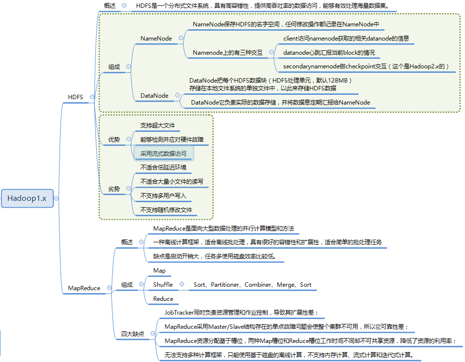

#### hadoop2.x：


### hadoop HA介绍？

- **<font color="red">HDFS High Availability</font>**[^6]

1. **Active NameNode 和 Standby NameNode**：两台 NameNode 形成互备，一台处于 Active 状态，为主 NameNode，另外一台处于 Standby 状态，为备 NameNode，只有主 NameNode 才能对外提供读写服务；
2. **ZKFailoverController（主备切换控制器，FC）**：ZKFailoverController 作为独立的进程运行，对 NameNode 的主备切换进行总体控制。ZKFailoverController 能及时检测到 NameNode 的健康状况，在主 NameNode 故障时借助 Zookeeper 实现自动的主备选举和切换（当然 NameNode 目前也支持不依赖于 Zookeeper 的手动主备切换）；
3. **Zookeeper 集群**：为主备切换控制器提供主备选举支持；
4. **共享存储系统**：共享存储系统是实现 NameNode 的高可用最为关键的部分，共享存储系统保存了 NameNode 在运行过程中所产生的 HDFS 的元数据。主 NameNode 和备 NameNode 通过共享存储系统实现元数据同步。在进行主备切换的时候，新的主 NameNode 在**确认元数据完全同步之后才能继续对外提供服务**。
5. **DataNode 节点**：因为主 NameNode 和备 NameNode 需要共享 HDFS 的数据块和 DataNode 之间的映射关系，为了使故障切换能够快速进行，DataNode 会同时向主 NameNode 和备 NameNode 上报数据块的位置信息。

### hadoop的常用配置文件？

**在TPC-H的测评实验中，使用配置文件见github.com/maomao1994/TPC-H[^7]**

1. **<font color="red">hadoop-env.sh</font>**: 用于定义hadoop运行环境相关的配置信息，比如配置JAVA_HOME环境变量、为hadoop的JVM指定特定的选项、指定日志文件所在的目录路径以及master和slave文件的位置等；
2. **<font color="red">core-site.xml</font>**: 用于定义系统级别的参数，如HDFS URL、Hadoop的临时目录以及用于rack-aware集群中的配置文件的配置等，此中的参数定义会覆盖core-default.xml文件中的默认配置；
3. **<font color="red">hdfs-site.xml</font>**: HDFS的相关设定，如文件副本的个数、块大小及是否使用强制权限等，此中的参数定义会覆盖hdfs-default.xml文件中的默认配置；
4. **<font color="red">mapred-site.xml</font>**：HDFS的相关设定，如reduce任务的默认个数、任务所能够使用内存的默认上下限等，此中的参数定义会覆盖mapred-default.xml文件中的默认配置；
5. **<font color="red">yarn-site.xml</font>**
6. **<font color="red">~/hadoop/etc/hadoop/slaves</font>**

### 小文件过多会有什么危害,如何避免？

Hadoop上大量HDFS元数据信息存储在NameNode内存中,因此过多的小文件必定会压垮NameNode的内存.

每个元数据对象约占150byte，所以如果有1千万个小文件，每个文件占用一个block，则NameNode大约需要2G空间。如果存储1亿个文件，则NameNode需要20G空间.

显而易见的解决这个问题的方法就是合并小文件,可以选择在客户端上传时执行一定的策略先合并,或者是使用Hadoop的CombineFileInputFormat<K,V>实现小文件的合并

### 启动hadoop集群会分别启动哪些进程,各自的作用？

1. **<font color="red">NameNode：</font>**
   - 维护文件系统树及整棵树内所有的文件和目录。这些信息永久保存在本地磁盘的两个文件中：命名空间镜像文件、编辑日志文件
   - 记录每个文件中各个块所在的数据节点信息，这些信息在内存中保存，每次启动系统时重建这些信息
   - 负责响应客户端的   数据块位置请求  。也就是客户端想存数据，应该往哪些节点的哪些块存；客户端想取数据，应该到哪些节点取
   - 接受记录在数据存取过程中，datanode节点报告过来的故障、损坏信息

2. **<font color="red">SecondaryNameNode(非HA模式)：</font>**
   - 实现namenode容错的一种机制。定期合并编辑日志与命名空间镜像，当namenode挂掉时，可通过一定步骤进行上顶。(**注意 并不是NameNode的备用节点**)
3. **<font color="red">DataNode：</font>**
   - 根据需要存取并检索数据块
   - 定期向namenode发送其存储的数据块列表
4. **<font color="red">ResourceManager：</font>**
   - 负责Job的调度,将一个任务与一个NodeManager相匹配。也就是将一个MapReduce之类的任务分配给一个从节点的NodeManager来执行。
5. **<font color="red">NodeManager：</font>**
   - 运行ResourceManager分配的任务，同时将任务进度向application master报告

6. **<font color="red">JournalNode(HA下启用):</font>**
   - 高可用情况下存放namenode的editlog文件

## HIVE

### 介绍

The Apache Hive ™ data warehouse software facilitates<font color="red"> reading, writing, and managing large datasets residing in distributed storage using SQL.</font> Structure can be projected onto data already in storage. A command line tool and JDBC driver are provided to connect users to Hive.

### HIVE架构

**<font color="red">下面是hive的架构图</font>[^9]**


| Unit Name             | Operation                                                    |
| --------------------- | ------------------------------------------------------------ |
| User Interface        | Hive is a data warehouse infrastructure software that can create interaction between user and HDFS. The user interfaces that Hive supports are Hive Web UI, Hive command line, and Hive HD Insight (In Windows server). |
| Meta Store            | Hive chooses respective database servers to store the schema or Metadata of tables, databases, columns in a table, their data types, and HDFS mapping. |
| HiveQL Process Engine | HiveQL is similar to SQL for querying on schema info on the Metastore. It is one of the replacements of traditional approach for MapReduce program. Instead of writing MapReduce program in Java, we can write a query for MapReduce job and process it. |
| Execution Engine      | The conjunction part of HiveQL process Engine and MapReduce is Hive Execution Engine. Execution engine processes the query and generates results as same as MapReduce results. It uses the flavor of MapReduce. |
| HDFS or HBASE         | Hadoop distributed file system or HBASE are the data storage techniques to store data into file system. |

<font color="red">**下面hive和hadoop的交互图[^9]**</font>

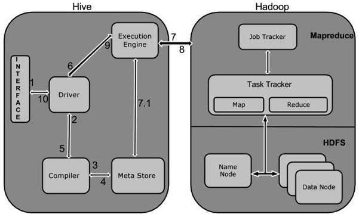

| Step No. | Operation                                                    |
| -------- | ------------------------------------------------------------ |
| 1        | **Execute Query**The Hive interface such as Command Line or Web UI sends query to Driver (any database driver such as JDBC, ODBC, etc.) to execute. |
| 2        | **Get Plan**The driver takes the help of query compiler that parses the query to check the syntax and query plan or the requirement of query. |
| 3        | **Get Metadata**The compiler sends metadata request to Metastore (any database). |
| 4        | **Send Metadata**Metastore sends metadata as a response to the compiler. |
| 5        | **Send Plan**The compiler checks the requirement and resends the plan to the driver. Up to here, the parsing and compiling of a query is complete. |
| 6        | **Execute Plan**The driver sends the execute plan to the execution engine. |
| 7        | **Execute Job**Internally, the process of execution job is a MapReduce job. The execution engine sends the job to JobTracker, which is in Name node and it assigns this job to TaskTracker, which is in Data node. Here, the query executes MapReduce job. |
| 7.1      | **Metadata Ops**Meanwhile in execution, the execution engine can execute metadata operations with Metastore. |
| 8        | **Fetch Result**The execution engine receives the results from Data nodes. |
| 9        | **Send Results**The execution engine sends those resultant values to the driver. |
| 10       | **Send Results**The driver sends the results to Hive Interfaces. |


### hive的数据类型

<font color="red">**All the data types in Hive are classified into four types, given as follows:[^9]**</font>

1. Column Types
2. Literals
3. Null Values
4. Complex Types

hive的数据类型细分如下：

| 类型                                       | 细分                     | 备注                                                         |
| ------------------------------------------ | ------------------------ | ------------------------------------------------------------ |
| <font color="red">**Column Types**</font>  | **Integral Types**       | TINYINT，SMALLINT，INT，BIGINT                               |
|                                            | **String Types**         | VARCHAR，CHAR                                                |
|                                            | **Timestamp**            | It supports traditional UNIX timestamp with optional nanosecond precision. <br>It supports java.sql.Timestamp format “YYYY-MM-DD HH:MM:SS.fffffffff” and format “yyyy-mm-dd hh:mm:ss.ffffffffff”. |
|                                            | **Dates**                | {{YYYY-MM-DD}}.                                              |
|                                            | **Decimals**             | as same as Big Decimal format of Java<br>DECIMAL(precision, scale) |
|                                            | **Union Types**          | UNIONTYPE\<int, double, array\<string>, struct\<a:int,b:string>> |
| **<font color="red">Literals</font>**      | **Floating Point Types** | numbers with decimal points                                  |
|                                            | **Decimal Type**         | Decimal type data is nothing but floating point value with higher range than DOUBLE data type. The range of decimal type is approximately -10^-308 to 10^308. |
| **<font color="red">Null Value</font>**    |                          |                                                              |
| **<font color="red">Complex Types</font>** | **Arrays**               | Syntax: ARRAY\<data_type>                                    |
|                                            | **Maps**                 | Syntax: MAP\<primitive_type, data_type>                      |
|                                            | **Structs**              | Syntax: STRUCT\<col_name : data_type [COMMENT col_comment], ...> |


### SQL和JDBC

<font color="red">**请参考教程[^9]**</font>

### hive 内部表和外部表的区别？

- 建表时带有external关键字为外部表，否则为内部表
- 内部表和外部表建表时都可以自己指定location
- 删除表时，外部表不会删除对应的数据，只会删除元数据信息，内部表则会删除
- 其他用法是一样的

### Hive中 <font color="red">sort by / order by / cluster by / distribute by </font>的区别？

- **order by** 
      order by 是要对输出的结果进行全局排序，这就意味着**只有一个reducer**才能实现（多个reducer无法保证全局有序）但是当数据量过大的时候，效率就很低。如果在严格模式下（hive.mapred.mode=strict）,则必须配合limit使用

- **sort by**
      sort by 不是全局排序，只是在进入到reducer之前完成排序，只保证了每个reducer中数据按照指定字段的有序性，是局部排序。配置mapred.reduce.tasks=[nums]可以对输出的数据执行归并排序。可以配合limit使用，提高性能

- **distribute by** 
      distribute by 指的是按照指定的字段划分到不同的输出reduce文件中，和sort by一起使用时需要注意，distribute by必须放在前面

- **cluster by**

  cluster by 可以看做是一个特殊的distribute by+sort by，它具备二者的功能，但是只能实现倒序排序的方式,不能指定排序规则为asc 或者desc

### hive的metastore的三种模式？

- **<font color="red">内嵌Derby方式</font>**

  这个是Hive默认的启动模式，一般用于单元测试，这种存储方式有一个缺点：在同一时间只能有一个进程连接使用数据库。

- **<font color="red">Local方式</font>**

  本地MySQL

- **<font color="red">Remote方式</font>**

  远程MySQL,一般常用此种方式

### hive 中 join都有哪些？

Hive中除了支持和传统数据库中一样的<font color="red">内关联（JOIN）、左关联（LEFT JOIN）、右关联（RIGHT JOIN）、全关联（FULL JOIN），还支持左半关联（LEFT SEMI JOIN）</font>

- **内关联（JOIN）**

  只返回能关联上的结果。

- **左外关联（LEFT [OUTER] JOIN）**

  以LEFT [OUTER] JOIN关键字前面的表作为主表，和其他表进行关联，返回记录和主表的记录数一致，关联不上的字段置为NULL。

- **右外关联（RIGHT [OUTER] JOIN）**

  和左外关联相反，以RIGTH [OUTER] JOIN关键词后面的表作为主表，和前面的表做关联，返回记录数和主表一致，关联不上的字段为NULL。

- **全外关联（FULL [OUTER] JOIN）**

  以两个表的记录为基准，返回两个表的记录去重之和，关联不上的字段为NULL。

- **LEFT SEMI JOIN**

  以LEFT SEMI JOIN关键字前面的表为主表，返回主表的KEY也在副表中的记录

- **笛卡尔积关联（CROSS JOIN）**

  返回两个表的笛卡尔积结果，不需要指定关联键。


### Impala 和 hive 的查询有哪些区别？

**Impala是基于Hive的大数据实时分析查询引擎**，直接使用Hive的元数据库Metadata,意味着impala元数据都存储在Hive的metastore中。并且impala兼容Hive的sql解析，实现了Hive的SQL语义的子集，功能还在不断的完善中。

**<font color="red">Impala相对于Hive所使用的优化技术</font>**

- 1、没有使用 MapReduce进行并行计算，虽然MapReduce是非常好的并行计算框架，但它更多的面向批处理模式，而不是面向交互式的SQL执行。与 MapReduce相比：Impala把整个查询分成一执行计划树，而不是一连串的MapReduce任务，在分发执行计划后，Impala使用拉式获取 数据的方式获取结果，把结果数据组成按执行树流式传递汇集，减少的了把中间结果写入磁盘的步骤，再从磁盘读取数据的开销。Impala使用服务的方式避免 每次执行查询都需要启动的开销，即相比Hive没了MapReduce启动时间。
- 2、使用LLVM产生运行代码，针对特定查询生成特定代码，同时使用Inline的方式减少函数调用的开销，加快执行效率。
- 3、充分利用可用的硬件指令（SSE4.2）。
- 4、更好的IO调度，Impala知道数据块所在的磁盘位置能够更好的利用多磁盘的优势，同时Impala支持直接数据块读取和本地代码计算checksum。
- 5、通过选择合适的数据存储格式可以得到最好的性能（Impala支持多种存储格式）。
- 6、最大使用内存，中间结果不写磁盘，及时通过网络以stream的方式传递。

### Hive中大表join小表的优化方法？

<font color="red">在小表和大表进行join时，将**小表放在前边**，效率会高，hive会将小表进行缓存</font>

### Hive Sql 是怎样解析成MR job的?

**主要分为6个阶段:**

1. **<font color="red">Hive使用Antlr实现语法解析</font>**.根据Antlr制定的SQL语法解析规则,完成SQL语句的词法/语法解析,<font color="red">将SQL转为抽象语法树AST.</font>
2. **<font color="red">遍历AST,生成基本查询单元QueryBlock</font>**.QueryBlock是一条SQL最基本的组成单元，包括三个部分：输入源，计算过程，输出.
3. **<font color="red">遍历QueryBlock,生成OperatorTree</font>**.Hive最终生成的MapReduce任务，<font color="red">Map阶段和Reduce阶段均由OperatorTree组成,</font>。Operator就是在Map阶段或者Reduce阶段完成单一特定的操作。QueryBlock生成Operator Tree就是遍历上一个过程中生成的QB和QBParseInfo对象的保存语法的属性.
4. **<font color="red">优化OperatorTree</font>**大部分逻辑层优化器通过变换OperatorTree，合并操作符，达到减少MapReduce Job，减少shuffle数据量的目的
5. **<font color="red">OperatorTree生成MapReduce Job</font>**.遍历OperatorTree,翻译成MR任务.
   - 对输出表生成MoveTask
   - 从OperatorTree的其中一个根节点向下深度优先遍历
   - ReduceSinkOperator标示Map/Reduce的界限，多个Job间的界限
   - 遍历其他根节点，遇过碰到JoinOperator合并MapReduceTask
   - 生成StatTask更新元数据
   - 剪断Map与Reduce间的Operator的关系
6. **<font color="red">优化任务.</font>** 使用物理优化器对MR任务进行优化,生成最终执行任务


### Hive UDF简单介绍？

在Hive中，用户可以自定义一些函数，用于扩展HiveQL的功能，而这类函数叫做UDF（用户自定义函数）。UDF分为两大类：UDAF（用户自定义聚合函数）和UDTF（用户自定义表生成函数）。

**<font color="red">Hive有两个不同的接口编写UDF程序。一个是基础的UDF接口，一个是复杂的GenericUDF接口。</font>**

1. **org.apache.hadoop.hive.ql. exec.UDF** 基础UDF的函数读取和返回基本类型，即Hadoop和Hive的基本类型。如，Text、IntWritable、LongWritable、DoubleWritable等。
2. **org.apache.hadoop.hive.ql.udf.generic.GenericUDF** 复杂的GenericUDF可以处理Map、List、Set类型。


### SQL题: 按照学生科目分组, 取每个科目的TopN？

```SQL
id,name,subject,score
1,小明,语文,87
2,张三,语文,27
3,王五,语文,69
4,李四,语文,99
5,小明,数学,86
6,马六,数学,33
7,李四,数学,44
8,小红,数学,50
```

**按照各个科目的成绩排名 取 Top3**

```
select a.* from
(select id,name,subject,score,row_number() over(partition by subject order by score desc) rank from student) a
where a.rank <= 3
```

### SQL题: 获取每个用户的前1/4次的数据？

```
cookieId  createTime    pv
--------------------------
cookie1 2015-04-10      1
cookie1 2015-04-11      5
cookie1 2015-04-12      7
cookie1 2015-04-13      3
cookie1 2015-04-14      2
cookie1 2015-04-15      4
cookie1 2015-04-16      4
cookie2 2015-04-10      2
cookie2 2015-04-11      3
cookie2 2015-04-12      5
cookie2 2015-04-13      6
cookie2 2015-04-14      3
cookie2 2015-04-15      9
cookie2 2015-04-16      7
```

获取每个用户前1/4次的访问记录

```
SELECT a.* from 
(SELECT cookieid,createtime,pv,NTILE(4)
OVER(PARTITION BY cookieId ORDER BY createtime) AS rn
from table ) a
WHERE a.rn = 1
```

<font color="red">NTILE(n)</font>，用于将分组数据按照顺序切分成n片，返回当前切片值


## Spark

### spark 的运行架构？


- **<font color="red">Cluster Manager(Master)</font>**：在standalone模式中即为Master主节点，控制整个集群，监控worker。在YARN模式中为资源管理器
- **<font color="red">Worker节点</font>**：从节点，负责控制计算节点，启动Executor或者Driver。
- **<font color="red">Driver</font>**： 运行Application 的main()函数
- **<font color="red">Executor</font>**：执行器，是为某个Application运行在worker node上的一个进程

### 一个spark程序的执行流程？


- **A ->** 当 Driver 进程被启动之后,首先它将发送请求到Master节点上,进行Spark应用程序的注册
- **B ->** Master在接受到Spark应用程序的注册申请之后,会发送给Worker,让其进行资源的调度和分配.
- **C ->** Worker 在接受Master的请求之后,会为Spark应用程序启动Executor, 来分配资源
- **D ->** Executor启动分配资源好后,就会想Driver进行反注册,这是Driver已经知道哪些Executor为他服务了
- **E ->** 当Driver得到注册了Executor之后,就可以开始正式执行spark应用程序了. 首先第一步,就是创建初始RDD,读取数据源,再执行之后的一系列算子. HDFS文件内容被读取到多个worker节点上,形成内存中的分布式数据集,也就是初始RDD
- **F ->** Driver就会根据 Job 任务任务中的算子形成对应的task,最后提交给 Executor, 来分配给task进行计算的线程
- **G ->** task就会去调用对应的任务数据来计算,并task会对调用过来的RDD的partition数据执行指定的算子操作,形成新的RDD的partition,这时一个大的循环就结束了
- 后续的RDD的partition数据又通过Driver形成新的一批task提交给Executor执行,循环这个操作,直到所有的算子结束


### spark的shuffle介绍？

**spark中的shuffle主要有3种:**

- **Hash Shuffle** 2.0以后移除

  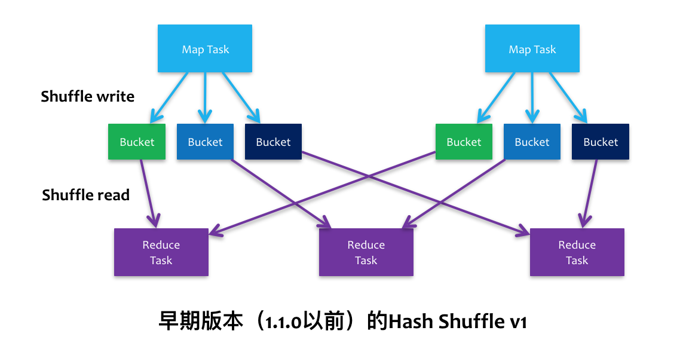

  在map阶段(shuffle write)，每个map都会为下游stage的每个partition写一个临时文件，假如下游stage有1000个partition，那么每个map都会生成1000个临时文件，一般来说一个executor上会运行多个map task，这样下来，一个executor上会有非常多的临时文件，假如一个executor上运行M个map task，下游stage有N个partition，那么一个executor上会生成M*N个文件。另一方面，如果一个executor上有K个core，那么executor同时可运行K个task，这样一来，就会同时申请K*N个文件描述符，一旦partition数较多，势必会耗尽executor上的文件描述符，同时生成K*N个write handler也会带来大量内存的消耗。

  在reduce阶段(shuffle read)，每个reduce task都会拉取所有map对应的那部分partition数据，那么executor会打开所有临时文件准备网络传输，这里又涉及到大量文件描述符，另外，如果reduce阶段有combiner操作，那么它会把网络中拉到的数据保存在一个`HashMap`中进行合并操作，如果数据量较大，很容易引发OOM操作。

- **Sort Shuffle** 1.1开始(sort shuffle也经历过优化升级,详细见参考文章1)

  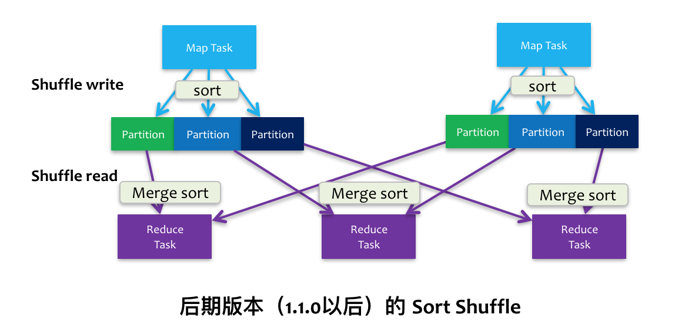

  在map阶段(shuffle write)，会按照partition id以及key对记录进行排序，将所有partition的数据写在同一个文件中，该文件中的记录首先是按照partition id排序一个一个分区的顺序排列，每个partition内部是按照key进行排序存放，map task运行期间会顺序写每个partition的数据，并通过一个索引文件记录每个partition的大小和偏移量。这样一来，每个map task一次只开两个文件描述符，一个写数据，一个写索引，大大减轻了Hash Shuffle大量文件描述符的问题，即使一个executor有K个core，那么最多一次性开K*2个文件描述符。

  在reduce阶段(shuffle read)，reduce task拉取数据做combine时不再是采用`HashMap`，而是采用`ExternalAppendOnlyMap`，该数据结构在做combine时，如果内存不足，会刷写磁盘，很大程度的保证了鲁棒性，避免大数据情况下的OOM。

- **Unsafe Shuffle** 1.5开始, 1.6与Sort shuffle合并

  从spark 1.5.0开始，spark开始了钨丝计划(Tungsten)，目的是优化内存和CPU的使用，进一步提升spark的性能。为此，引入Unsafe Shuffle，它的做法是将数据记录用二进制的方式存储，直接在序列化的二进制数据上sort而不是在java 对象上，这样一方面可以减少memory的使用和GC的开销，另一方面避免shuffle过程中频繁的序列化以及反序列化。在排序过程中，它提供cache-efficient sorter，使用一个8 bytes的指针，把排序转化成了一个指针数组的排序，极大的优化了排序性能.


------

**现在2.1 分为三种writer， 分为 BypassMergeSortShuffleWriter， SortShuffleWriter 和 UnsafeShuffleWriter**

#### 三种Writer的分类

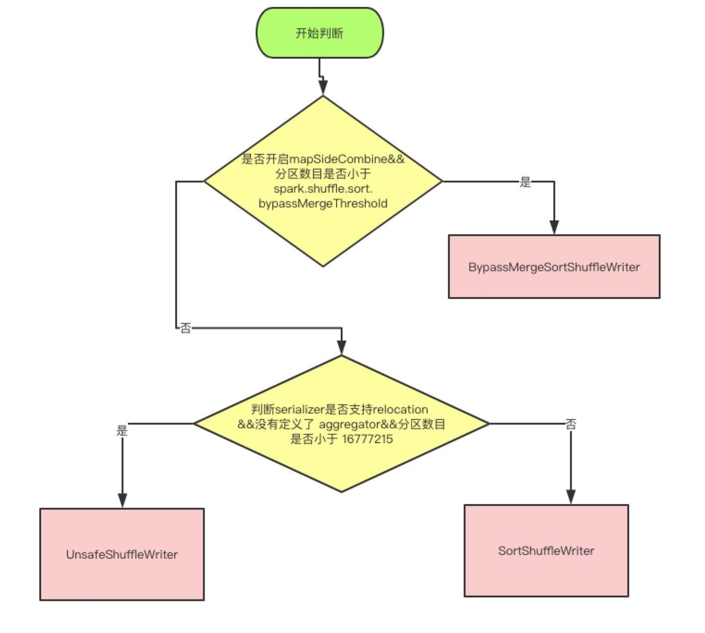


上面是使用哪种 writer 的判断依据， 是否开启 mapSideCombine 这个判断，是因为有些算子会在 map 端先进行一次 combine， 减少传输数据。 因为 BypassMergeSortShuffleWriter 会临时输出Reducer个（分区数目）小文件，所以分区数必须要小于一个阀值，默认是小于200

UnsafeShuffleWriter需要Serializer支持relocation，Serializer支持relocation：原始数据首先被序列化处理，并且再也不需要反序列，在其对应的元数据被排序后，需要Serializer支持relocation，在指定位置读取对应数据

[参考文章1](<http://sharkdtu.com/posts/spark-shuffle.html>)

[参考文章2](<http://spark.coolplayer.net/?p=576>)

### Spark的 partitioner 都有哪些?

**Partitioner主要有两个实现类：HashPartitioner和RangePartitioner,HashPartitioner是大部分transformation的默认实现，sortBy、sortByKey使用RangePartitioner实现，也可以自定义Partitioner.**

- **HashPartitioner**

  numPartitions方法返回传入的分区数，getPartition方法使用key的hashCode值对分区数取模得到PartitionId，写入到对应的bucket中。

- **RangePartitioner**

  RangePartitioner是先根据所有partition中数据的分布情况，尽可能均匀地构造出重分区的分隔符，再将数据的key值根据分隔符进行重新分区

  - 使用reservoir Sample方法对每个Partition进行分别抽样
  - 对数据量大(大于sampleSizePerPartition)的分区进行重新抽样
  - 由权重信息计算出分区分隔符rangeBounds
  - 由rangeBounds计算分区数和key的所属分区


[参考文章](<https://blog.csdn.net/qq_34842671/article/details/83685179>)

### spark 有哪几种join？

**Spark 中和 join 相关的算子有这几个**：`join`、`fullOuterJoin`、`leftOuterJoin`、`rightOuterJoin`

- **join**

  join函数会输出两个RDD中key相同的所有项，并将它们的value联结起来，它联结的key要求在两个表中都存在，类似于SQL中的INNER JOIN。但它不满足交换律，a.join(b)与b.join(a)的结果不完全相同，值插入的顺序与调用关系有关。

- **leftOuterJoin**

  leftOuterJoin会保留对象的所有key，而用None填充在参数RDD other中缺失的值，因此调用顺序会使结果完全不同。如下面展示的结果，

- **rightOuterJoin**

  rightOuterJoin与leftOuterJoin基本一致，区别在于它的结果保留的是参数other这个RDD中所有的key。

- **fullOuterJoin**

  fullOuterJoin会保留两个RDD中所有的key，因此所有的值列都有可能出现缺失的情况，所有的值列都会转为Some对象。


[参考文章](<http://www.neilron.xyz/join-in-spark/>)


### RDD有哪些特点？

1. **A list of partitions**
   RDD是一个由多个partition（某个节点里的某一片连续的数据）组成的的list；将数据加载为RDD时，一般会遵循数据的本地性（一般一个hdfs里的block会加载为一个partition）。

2. **A function for computing each split**
   RDD的每个partition上面都会有function，也就是函数应用，其作用是实现RDD之间partition的转换。

3. **A list of dependencies on other RDDs**
   RDD会记录它的依赖 ，为了容错（重算，cache，checkpoint），也就是说在内存中的RDD操作时出错或丢失会进行重算。

4. **Optionally,a Partitioner for Key-value RDDs**
   可选项，如果RDD里面存的数据是key-value形式，则可以传递一个自定义的Partitioner进行重新分区，例如这里自定义的Partitioner是基于key进行分区，那则会将不同RDD里面的相同key的数据放到同一个partition里面

5. **Optionally, a list of preferred locations to compute each split on**

   最优的位置去计算，也就是数据的本地性。

### 讲一下宽依赖和窄依赖？

区别宽窄依赖的核心点是 **子RDD的partition与父RDD的partition是否是1对多的关系**,如果是这样的关系的话,

说明多个父rdd的partition需要经过shuffle过程汇总到一个子rdd的partition,这样就是一次宽依赖,在DAGScheduler中会产生stage的切分.

### Spark中的算子都有哪些？

总的来说,spark分为两大类算子:

- **Transformation 变换/转换算子：这种变换并不触发提交作业，完成作业中间过程处理**

  Transformation 操作是延迟计算的，也就是说从一个RDD 转换生成另一个 RDD 的转换操作不是马上执行，需要等到有 Action 操作的时候才会真正触发运算

- **Action 行动算子：这类算子会触发 SparkContext 提交 Job 作业**

  Action 算子会触发 Spark 提交作业（Job），并将数据输出 Spark系统

  ------

#### 1. Value数据类型的Transformation算子

- 输入分区与输出分区一对一型
  - map算子
  - flatMap算子
  - mapPartitions算子
  - glom算子
- 输入分区与输出分区多对一型
  - union算子
  - cartesian算子
- 输入分区与输出分区多对多型
  - grouBy算子
- 输出分区为输入分区子集型
  - filter算子
  - distinct算子
  - subtract算子
  - sample算子
  - takeSample算子
- Cache型
  - cache算子
  - persist算子

#### 2. Key-Value数据类型的Transfromation算子

- 输入分区与输出分区一对一
  - mapValues算子
- 对单个RDD或两个RDD聚集
  - combineByKey算子
  - reduceByKey算子
  - partitionBy算子
  - Cogroup算子
- 连接
  - join算子
  - leftOutJoin 和 rightOutJoin算子

#### 3. Action算子

- 无输出
  - foreach算子
- HDFS算子
  - saveAsTextFile算子
  - saveAsObjectFile算子
- Scala集合和数据类型
  - collect算子
  - collectAsMap算子
  - reduceByKeyLocally算子
  - lookup算子
  - count算子
  - top算子
  - reduce算子
  - fold算子
  - aggregate算子
  - countByValue
  - countByKey

[参考文章](<https://www.cnblogs.com/kpsmile/p/10434390.html>)

### RDD的缓存级别都有哪些？

NONE :什么类型都不是
DISK_ONLY：磁盘
DISK_ONLY_2：磁盘；双副本
MEMORY_ONLY： 内存；反序列化；把RDD作为反序列化的方式存储，假如RDD的内容存不下，剩余的分区在以后需要时会重新计算，不会刷到磁盘上。
MEMORY_ONLY_2：内存；反序列化；双副本
MEMORY_ONLY_SER：内存；序列化；这种序列化方式，每一个partition以字节数据存储，好处是能带来更好的空间存储，但CPU耗费高
MEMORY_ONLY_SER_2 : 内存；序列化；双副本
MEMORY_AND_DISK：内存 + 磁盘；反序列化；双副本；RDD以反序列化的方式存内存，假如RDD的内容存不下，剩余的会存到磁盘
MEMORY_AND_DISK_2 : 内存 + 磁盘；反序列化；双副本
MEMORY_AND_DISK_SER：内存 + 磁盘；序列化  
MEMORY_AND_DISK_SER_2：内存 + 磁盘；序列化；双副本

### RDD 懒加载？

Transformation 操作是延迟计算的，也就是说从一个RDD 转换生成另一个 RDD 的转换操作不是马上执行，需要等到有 Acion 操作的时候才会真正触发运算,这也就是懒加载.

### spark的几种部署方式？

**目前,除了local模式为本地调试模式以为, Spark支持三种分布式部署方式，分别是standalone、spark on mesos和 spark on YARN**

- **Standalone模式**

  即独立模式，自带完整的服务，可单独部署到一个集群中，无需依赖任何其他资源管理系统。从一定程度上说，该模式是其他两种的基础。目前Spark在standalone模式下是没有任何单点故障问题的，这是借助zookeeper实现的，思想类似于Hbase master单点故障解决方案。将Spark standalone与MapReduce比较，会发现它们两个在架构上是完全一致的： 

  - 都是由master/slaves服务组成的，且起初master均存在单点故障，后来均通过zookeeper解决（Apache MRv1的JobTracker仍存在单点问题，但CDH版本得到了解决）； 
  - 各个节点上的资源被抽象成粗粒度的slot，有多少slot就能同时运行多少task。不同的是，MapReduce将slot分为map slot和reduce slot，它们分别只能供Map Task和Reduce Task使用，而不能共享，这是MapReduce资源利率低效的原因之一，而Spark则更优化一些，它不区分slot类型，只有一种slot，可以供各种类型的Task使用，这种方式可以提高资源利用率，但是不够灵活，不能为不同类型的Task定制slot资源。总之，这两种方式各有优缺点。 

- **Spark On YARN模式**

  **spark on yarn 的支持两种模式：** 

  - yarn-cluster：适用于生产环境； 
  - yarn-client：适用于交互、调试，希望立即看到app的输出 

  yarn-cluster和yarn-client的区别在于yarn appMaster，每个yarn app实例有一个appMaster进程，是为app启动的第一个container；负责从ResourceManager请求资源，获取到资源后，告诉NodeManager为其启动container。yarn-cluster和yarn-client模式内部实现还是有很大的区别。如果你需要用于生产环境，那么请选择yarn-cluster；而如果你仅仅是Debug程序，可以选择yarn-client。

- **Spark On Mesos模式**

  Spark运行在Mesos上会比运行在YARN上更加灵活，更加自然。目前在Spark On Mesos环境中，用户可选择两种调度模式之一运行自己的应用程序

  - 粗粒度模式（Coarse-grained Mode）：每个应用程序的运行环境由一个Dirver和若干个Executor组成，其中，每个Executor占用若干资源，内部可运行多个Task（对应多少个“slot”）。应用程序的各个任务正式运行之前，需要将运行环境中的资源全部申请好，且运行过程中要一直占用这些资源，即使不用，最后程序运行结束后，回收这些资源。
  - 细粒度模式（Fine-grained Mode）：鉴于粗粒度模式会造成大量资源浪费，Spark On Mesos还提供了另外一种调度模式：细粒度模式，这种模式类似于现在的云计算，思想是按需分配。与粗粒度模式一样，应用程序启动时，先会启动executor，但每个executor占用资源仅仅是自己运行所需的资源，不需要考虑将来要运行的任务，之后，mesos会为每个executor动态分配资源，每分配一些，便可以运行一个新任务，单个Task运行完之后可以马上释放对应的资源。

### spark on yarn 模式下的 cluster模式和 client模式有什么区别？

1. yarn-cluster 适用于生产环境。而 yarn-client 适用于交互和调试，也就是希望快速地看到 application 的输出.
2. yarn-cluster 和 yarn-client 模式的区别其实就是 **Application Master 进程**的区别，yarn-cluster 模式下，driver 运行在 AM(Application Master)中，它负责向 YARN 申请资源，并监督作业的运行状况。当用户提交了作业之后，就可以关掉 Client，作业会继续在 YARN 上运行。然而 yarn-cluster 模式不适合运行交互类型的作业。而 yarn-client 模式下，Application Master 仅仅向 YARN 请求 executor，Client 会和请求的container 通信来调度他们工作，也就是说 Client 不能离开。

### spark运行原理,从提交一个jar到最后返回结果,整个过程？

1. `spark-submit` 提交代码，执行 `new SparkContext()`，在 SparkContext 里构造 `DAGScheduler` 和 `TaskScheduler`。
2. TaskScheduler 会通过后台的一个进程，连接 Master，向 Master 注册 Application。
3. Master 接收到 Application 请求后，会使用相应的资源调度算法，在 Worker 上为这个 Application 启动多个 Executer。
4. Executor 启动后，会自己反向注册到 TaskScheduler 中。 所有 Executor 都注册到 Driver 上之后，SparkContext 结束初始化，接下来往下执行我们自己的代码。
5. 每执行到一个 Action，就会创建一个 Job。Job 会提交给 DAGScheduler。
6. DAGScheduler 会将 Job划分为多个 stage，然后每个 stage 创建一个 TaskSet。
7. TaskScheduler 会把每一个 TaskSet 里的 Task，提交到 Executor 上执行。
8. Executor 上有线程池，每接收到一个 Task，就用 TaskRunner 封装，然后从线程池里取出一个线程执行这个 task。(TaskRunner 将我们编写的代码，拷贝，反序列化，执行 Task，每个 Task 执行 RDD 里的一个 partition)

### spark的stage是如何划分的？

**stage的划分依据就是看是否产生了shuflle(即宽依赖),遇到一个shuffle操作就划分为前后两个stage.**


### spark的rpc: spark2.0为什么放弃了akka 而用netty？

1. 很多Spark用户也使用Akka，但是由于Akka不同版本之间无法互相通信，这就要求用户必须使用跟Spark完全一样的Akka版本，导致用户无法升级Akka。
2. Spark的Akka配置是针对Spark自身来调优的，可能跟用户自己代码中的Akka配置冲突。
3. Spark用的Akka特性很少，这部分特性很容易自己实现。同时，这部分代码量相比Akka来说少很多，debug比较容易。如果遇到什么bug，也可以自己马上fix，不需要等Akka上游发布新版本。而且，Spark升级Akka本身又因为第一点会强制要求用户升级他们使用的Akka，对于某些用户来说是不现实的。


[参考文章](<https://www.zhihu.com/question/61638635>)


### spark的各种HA?

master/worker/executor/driver/task的ha

- #### Master异常

  spark可以在集群运行时启动一个或多个standby Master,当 Master 出现异常时,会根据规则启动某个standby master接管,在standlone模式下有如下几种配置

  - ZOOKEEPER

    集群数据持久化到zk中,当master出现异常时,zk通过选举机制选出新的master,新的master接管是需要从zk获取持久化信息

  - FILESYSTEM

    集群元数据信息持久化到本地文件系统, 当master出现异常时,只需要在该机器上重新启动master,启动后新的master获取持久化信息并根据这些信息恢复集群状态

  - CUSTOM

    自定义恢复方式,对 standloneRecoveryModeFactory 抽象类 进行实现并把该类配置到系统中,当master出现异常时,会根据用户自定义行为恢复集群

  - None

    不持久化集群的元数据, 当 master出现异常时, 新启动的Master 不进行恢复集群状态,而是直接接管集群

- #### Worker异常

  Worker 以定时发送心跳给 Master, 让 Master 知道 Worker 的实时状态,当worker出现超时时,Master 调用 timeOutDeadWorker 方法进行处理,在处理时根据 Worker 运行的是 Executor 和 Driver 分别进行处理

  - 如果是Executor, Master先把该 Worker 上运行的Executor 发送信息ExecutorUpdate给对应的Driver,告知Executor已经丢失,同时把这些Executor从其应用程序列表删除, 另外, 相关Executor的异常也需要处理
  - 如果是Driver, 则判断是否设置重新启动,如果需要,则调用Master.shedule方法进行调度,分配合适节点重启Driver, 如果不需要重启, 则删除该应用程序

- #### Executor异常

  1. Executor发生异常时由ExecutorRunner捕获该异常并发送ExecutorStateChanged信息给Worker
  2. Worker接收到消息时, 在Worker的 handleExecutorStateChanged 方法中, 根据Executor状态进行信息更新,同时把Executor状态发送给Master
  3. Master在接受Executor状态变化消息之后,如果发现其是异常退出,会尝试可用的Worker节点去启动Executor

  

### spark的内存管理机制,spark 1.6前后分析对比, spark2.0 做出来哪些优化？

**spark的内存结构分为3大块:storage/execution/系统自留**

- **storage 内存**：用于缓存 RDD、展开 partition、存放 Direct Task Result、存放广播变量。在 Spark Streaming receiver 模式中，也用来存放每个 batch 的 blocks

- **execution 内存**：用于 shuffle、join、sort、aggregation 中的缓存、buffer

- **系统自留**:

  - 在 spark 运行过程中使用：比如序列化及反序列化使用的内存，各个对象、元数据、临时变量使用的内存，函数调用使用的堆栈等
  - 作为误差缓冲：由于 storage 和 execution 中有很多内存的使用是估算的，存在误差。当 storage 或 execution 内存使用超出其最大限制时，有这样一个安全的误差缓冲在可以大大减小 OOM 的概率

  

------

#### 1.6版本以前的问题

- 旧方案最大的问题是 storage 和 execution 的内存大小都是固定的，不可改变，即使 execution 有大量的空闲内存且 storage 内存不足，storage 也无法使用 execution 的内存，只能进行 spill，反之亦然。所以，在很多情况下存在资源浪费
- 旧方案中，只有 execution 内存支持 off heap，storage 内存不支持 off heap

#### 新方案的改进

- 新方案 storage 和 execution 内存可以互相借用，当一方内存不足可以向另一方借用内存，提高了整体的资源利用率
- 新方案中 execution 内存和 storage 内存均支持 off heap


### spark 中的广播变量？

[图片来源](<https://www.jianshu.com/p/6ef7f0a44fbf>) /[文字来源](<https://github.com/JerryLead/SparkInternals/blob/master/markdown/7-Broadcast.md>)

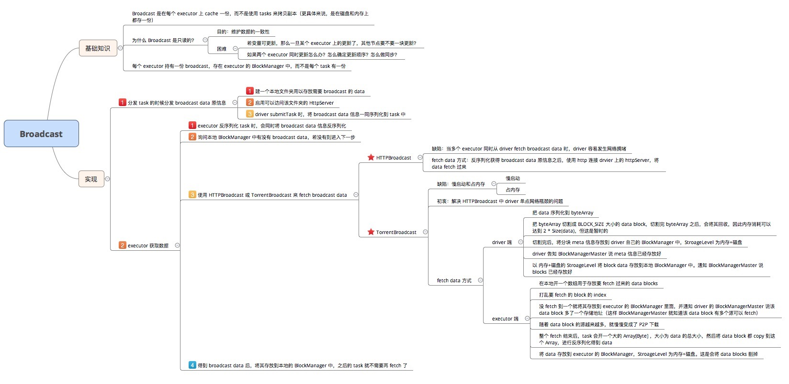

**顾名思义，broadcast 就是将数据从一个节点发送到其他各个节点上去。这样的场景很多，比如 driver 上有一张表，其他节点上运行的 task 需要 lookup 这张表，那么 driver 可以先把这张表 copy 到这些节点，这样 task 就可以在本地查表了。如何实现一个可靠高效的 broadcast 机制是一个有挑战性的问题。先看看 Spark 官网上的一段话：**

Broadcast variables allow the programmer to keep a **read-only** variable cached on each **machine** rather than shipping a copy of it with **tasks**. They can be used, for example, to give every node a copy of a **large input dataset** in an efficient manner. Spark also attempts to distribute broadcast variables using **efficient** broadcast algorithms to reduce communication cost.

#### 问题：为什么只能 broadcast 只读的变量？

这就涉及一致性的问题，如果变量可以被更新，那么一旦变量被某个节点更新，其他节点要不要一块更新？如果多个节点同时在更新，更新顺序是什么？怎么做同步？还会涉及 fault-tolerance 的问题。为了避免维护数据一致性问题，Spark 目前只支持 broadcast 只读变量。

#### 问题：broadcast 到节点而不是 broadcast 到每个 task？

因为每个 task 是一个线程，而且同在一个进程运行 tasks 都属于同一个 application。因此每个节点（executor）上放一份就可以被所有 task 共享。

#### 问题： 具体怎么用 broadcast？

driver program 例子：

```
val data = List(1, 2, 3, 4, 5, 6)
val bdata = sc.broadcast(data)

val rdd = sc.parallelize(1 to 6, 2)
val observedSizes = rdd.map(_ => bdata.value.size)
```

driver 使用 `sc.broadcast()` 声明要 broadcast 的 data，bdata 的类型是 Broadcast。

当 `rdd.transformation(func)` 需要用 bdata 时，直接在 func 中调用，比如上面的例子中的 map() 就使用了 bdata.value.size。

#### 问题：怎么实现 broadcast？

broadcast 的实现机制很有意思：

1. 分发 task 的时候先分发 bdata 的元信息

Driver 先建一个本地文件夹用以存放需要 broadcast 的 data，并启动一个可以访问该文件夹的 HttpServer。当调用`val bdata = sc.broadcast(data)`时就把 data 写入文件夹，同时写入 driver 自己的 blockManger 中（StorageLevel 为内存＋磁盘），获得一个 blockId，类型为 BroadcastBlockId。当调用`rdd.transformation(func)`时，如果 func 用到了 bdata，那么 driver submitTask() 的时候会将 bdata 一同 func 进行序列化得到 serialized task，**注意序列化的时候不会序列化 bdata 中包含的 data。**上一章讲到 serialized task 从 driverActor 传递到 executor 时使用 Akka 的传消息机制，消息不能太大，而实际的 data 可能很大，所以这时候还不能 broadcast data。

> driver 为什么会同时将 data 放到磁盘和 blockManager 里面？放到磁盘是为了让 HttpServer 访问到，放到 blockManager 是为了让 driver program 自身使用 bdata 时方便（其实我觉得不放到 blockManger 里面也行）。

**那么什么时候传送真正的 data？**在 executor 反序列化 task 的时候，会同时反序列化 task 中的 bdata 对象，这时候会调用 bdata 的 readObject() 方法。该方法先去本地 blockManager 那里询问 bdata 的 data 在不在 blockManager 里面，如果不在就使用下面的两种 fetch 方式之一去将 data fetch 过来。得到 data 后，将其存放到 blockManager 里面，这样后面运行的 task 如果需要 bdata 就不需要再去 fetch data 了。如果在，就直接拿来用了。

下面探讨 broadcast data 时候的两种实现方式：

2. HttpBroadcast

顾名思义，HttpBroadcast 就是每个 executor 通过的 http 协议连接 driver 并从 driver 那里 fetch data。

Driver 先准备好要 broadcast 的 data，调用`sc.broadcast(data)`后会调用工厂方法建立一个 HttpBroadcast 对象。该对象做的第一件事就是将 data 存到 driver 的 blockManager 里面，StorageLevel 为内存＋磁盘，blockId 类型为 BroadcastBlockId。

同时 driver 也会将 broadcast 的 data 写到本地磁盘，例如写入后得到 `/var/folders/87/grpn1_fn4xq5wdqmxk31v0l00000gp/T/spark-6233b09c-3c72-4a4d-832b-6c0791d0eb9c/broadcast_0`， 这个文件夹作为 HttpServer 的文件目录。

> Driver 和 executor 启动的时候，都会生成 broadcastManager 对象，调用 HttpBroadcast.initialize()，driver 会在本地建立一个临时目录用来存放 broadcast 的 data，并启动可以访问该目录的 httpServer。

**Fetch data：**在 executor 反序列化 task 的时候，会同时反序列化 task 中的 bdata 对象，这时候会调用 bdata 的 readObject() 方法。该方法先去本地 blockManager 那里询问 bdata 的 data 在不在 blockManager 里面，**如果不在就使用 http 协议连接 driver 上的 httpServer，将 data fetch 过来。**得到 data 后，将其存放到 blockManager 里面，这样后面运行的 task 如果需要 bdata 就不需要再去 fetch data 了。如果在，就直接拿来用了。

HttpBroadcast 最大的问题就是 **driver 所在的节点可能会出现网络拥堵**，因为 worker 上的 executor 都会去 driver 那里 fetch 数据。

3. TorrentBroadcast

为了解决 HttpBroadast 中 driver 单点网络瓶颈的问题，Spark 又设计了一种 broadcast 的方法称为 TorrentBroadcast，**这个类似于大家常用的 BitTorrent 技术。**基本思想就是将 data 分块成 data blocks，然后假设有 executor fetch 到了一些 data blocks，那么这个 executor 就可以被当作 data server 了，随着 fetch 的 executor 越来越多，有更多的 data server 加入，data 就很快能传播到全部的 executor 那里去了。

HttpBroadcast 是通过传统的 http 协议和 httpServer 去传 data，在 TorrentBroadcast 里面使用在上一章介绍的 blockManager.getRemote() => NIO ConnectionManager 传数据的方法来传递，读取数据的过程与读取 cached rdd 的方式类似，可以参阅 [CacheAndCheckpoint](https://github.com/JerryLead/SparkInternals/blob/master/markdown/6-CacheAndCheckpoint.md) 中的最后一张图。

下面讨论 TorrentBroadcast 的一些细节：

[](https://github.com/JerryLead/SparkInternals/blob/master/markdown/PNGfigures/TorrentBroadcast.png)

driver 端：

Driver 先把 data 序列化到 byteArray，然后切割成 BLOCK_SIZE（由 `spark.broadcast.blockSize = 4MB` 设置）大小的 data block，每个 data block 被 TorrentBlock 对象持有。切割完 byteArray 后，会将其回收，因此内存消耗虽然可以达到 2 * Size(data)，但这是暂时的。

完成分块切割后，就将分块信息（称为 meta 信息）存放到 driver 自己的 blockManager 里面，StorageLevel 为内存＋磁盘，同时会通知 driver 自己的 blockManagerMaster 说 meta 信息已经存放好。**通知 blockManagerMaster 这一步很重要，因为 blockManagerMaster 可以被 driver 和所有 executor 访问到，信息被存放到 blockManagerMaster 就变成了全局信息。**

之后将每个分块 data block 存放到 driver 的 blockManager 里面，StorageLevel 为内存＋磁盘。存放后仍然通知 blockManagerMaster 说 blocks 已经存放好。到这一步，driver 的任务已经完成。

Executor 端：

executor 收到 serialized task 后，先反序列化 task，这时候会反序列化 serialized task 中包含的 bdata 类型是 TorrentBroadcast，也就是去调用 TorrentBroadcast.readObject()。这个方法首先得到 bdata 对象，**然后发现 bdata 里面没有包含实际的 data。怎么办？**先询问所在的 executor 里的 blockManager 是会否包含 data（通过查询 data 的 broadcastId），包含就直接从本地 blockManager 读取 data。否则，就通过本地 blockManager 去连接 driver 的 blockManagerMaster 获取 data 分块的 meta 信息，获取信息后，就开始了 BT 过程。

**BT 过程：**task 先在本地开一个数组用于存放将要 fetch 过来的 data blocks `arrayOfBlocks = new Array[TorrentBlock](totalBlocks)`，TorrentBlock 是对 data block 的包装。然后打乱要 fetch 的 data blocks 的顺序，比如如果 data block 共有 5 个，那么打乱后的 fetch 顺序可能是 3-1-2-4-5。然后按照打乱后的顺序去 fetch 一个个 data block。fetch 的过程就是通过 “本地 blockManager －本地 connectionManager－driver/executor 的 connectionManager－driver/executor 的 blockManager－data” 得到 data，这个过程与 fetch cached rdd 类似。**每 fetch 到一个 block 就将其存放到 executor 的 blockManager 里面，同时通知 driver 上的 blockManagerMaster 说该 data block 多了一个存储地址。**这一步通知非常重要，意味着 blockManagerMaster 知道 data block 现在在 cluster 中有多份，下一个不同节点上的 task 再去 fetch 这个 data block 的时候，可以有两个选择了，而且会随机选择一个去 fetch。这个过程持续下去就是 BT 协议，随着下载的客户端越来越多，data block 服务器也越来越多，就变成 p2p下载了。关于 BT 协议，Wikipedia 上有一个[动画](http://zh.wikipedia.org/wiki/BitTorrent_(%E5%8D%8F%E8%AE%AE))。

整个 fetch 过程结束后，task 会开一个大 Array[Byte]，大小为 data 的总大小，然后将 data block 都 copy 到这个 Array，然后对 Array 中 bytes 进行反序列化得到原始的 data，这个过程就是 driver 序列化 data 的反过程。

最后将 data 存放到 task 所在 executor 的 blockManager 里面，StorageLevel 为内存＋磁盘。显然，这时候 data 在 blockManager 里存了两份，不过等全部 executor 都 fetch 结束，存储 data blocks 那份可以删掉了。

#### 问题：broadcast RDD 会怎样?

[@Andrew-Xia](http://weibo.com/u/1410938285) 回答道：不会怎样，就是这个rdd在每个executor中实例化一份。

#### Discussion

公共数据的 broadcast 是很实用的功能，在 Hadoop 中使用 DistributedCache，比如常用的`-libjars`就是使用 DistributedCache 来将 task 依赖的 jars 分发到每个 task 的工作目录。不过分发前 DistributedCache 要先将文件上传到 HDFS。这种方式的主要问题是**资源浪费**，如果某个节点上要运行来自同一 job 的 4 个 mapper，那么公共数据会在该节点上存在 4 份（每个 task 的工作目录会有一份）。但是通过 HDFS 进行 broadcast 的好处在于**单点瓶颈不明显**，因为公共 data 首先被分成多个 block，然后不同的 block 存放在不同的节点。这样，只要所有的 task 不是同时去同一个节点 fetch 同一个 block，网络拥塞不会很严重。

对于 Spark 来讲，broadcast 时考虑的不仅是如何将公共 data 分发下去的问题，还要考虑如何让同一节点上的 task 共享 data。

对于第一个问题，Spark 设计了两种 broadcast 的方式，传统存在单点瓶颈问题的 HttpBroadcast，和类似 BT 方式的 TorrentBroadcast。HttpBroadcast 使用传统的 client-server 形式的 HttpServer 来传递真正的 data，而 TorrentBroadcast 使用 blockManager 自带的 NIO 通信方式来传递 data。TorrentBroadcast 存在的问题是**慢启动**和**占内存**，慢启动指的是刚开始 data 只在 driver 上有，要等 executors fetch 很多轮 data block 后，data server 才会变得可观，后面的 fetch 速度才会变快。executor 所占内存的在 fetch 完 data blocks 后进行反序列化时需要将近两倍 data size 的内存消耗。不管哪一种方式，driver 在分块时会有两倍 data size 的内存消耗。

对于第二个问题，每个 executor 都包含一个 blockManager 用来管理存放在 executor 里的数据，将公共数据存放在 blockManager 中（StorageLevel 为内存＋磁盘），可以保证在 executor 执行的 tasks 能够共享 data。

其实 Spark 之前还尝试了一种称为 TreeBroadcast 的机制，详情可以见技术报告 [Performance and Scalability of Broadcast in Spark](http://www.cs.berkeley.edu/~agearh/cs267.sp10/files/mosharaf-spark-bc-report-spring10.pdf)。

更深入点，broadcast 可以用多播协议来做，不过多播使用 UDP，不是可靠的，仍然需要应用层的设计一些可靠性保障机制。

### 数据倾斜,怎样去处理数据倾斜？

数据倾斜是一种很常见的问题（依据二八定律），简单来说，比方WordCount中某个Key对应的数据量非常大的话，就会产生数据倾斜，导致两个后果：

- OOM（单或少数的节点）；
- 拖慢整个Job执行时间（其他已经完成的节点都在等这个还在做的节点）


#### 数据倾斜主要分为两类: 聚合倾斜 和 join倾斜

- **聚合倾斜**

  - **双重聚合（局部聚合+全局聚合）**

    **场景**: 对RDD进行reduceByKey等聚合类shuffle算子，SparkSQL的groupBy做分组聚合这两种情况
     思路：首先通过map给每个key打上n以内的随机数的前缀并进行局部聚合，即(hello, 1) (hello, 1) (hello, 1) (hello, 1)变为(1_hello, 1) (1_hello, 1) (2_hello, 1)，并进行reduceByKey的局部聚合，然后再次map将key的前缀随机数去掉再次进行全局聚合；
     **原理**: 对原本相同的key进行随机数附加，变成不同key，让原本一个task处理的数据分摊到多个task做局部聚合，规避单task数据过量。之后再去随机前缀进行全局聚合；
     优点：效果非常好（对聚合类Shuffle操作的倾斜问题）；
     缺点：范围窄（仅适用于聚合类的Shuffle操作，join类的Shuffle还需其它方案）

- **join倾斜**

  - **将reduce join转为map join**

    **场景**: 对RDD或Spark SQL使用join类操作或语句，且join操作的RDD或表比较小（百兆或1,2G）； 思路：使用broadcast和map类算子实现join的功能替代原本的join，彻底规避shuffle。对较小RDD直接collect到内存，并创建broadcast变量；并对另外一个RDD执行map类算子，在该算子的函数中，从broadcast变量（collect出的较小RDD）与当前RDD中的每条数据依次比对key，相同的key执行你需要方式的join；

    **原理**: 若RDD较小，可采用广播小的RDD，并对大的RDD进行map，来实现与join同样的效果。简而言之，用broadcast-map代替join，规避join带来的shuffle（无Shuffle无倾斜）； 优点：效果很好（对join操作导致的倾斜），根治； 

    **缺点**：适用场景小（大表+小表），广播（driver和executor节点都会驻留小表数据）小表也耗内存

  - **采样倾斜key并分拆join操作**

    **场景**: 两个较大的（无法采用方案五）RDD/Hive表进行join时，且一个RDD/Hive表中少数key数据量过大，另一个RDD/Hive表的key分布较均匀（RDD中两者之一有一个更倾斜）；
    **思路**:

    1. 对更倾斜rdd1进行采样（RDD.sample）并统计出数据量最大的几个key；
    2. 对这几个倾斜的key从原本rdd1中拆出形成一个单独的rdd1_1，并打上0~n的随机数前缀，被拆分的原rdd1的另一部分（不包含倾斜key）又形成一个新rdd1_2；
    3. 对rdd2过滤出rdd1倾斜的key，得到rdd2_1，并将其中每条数据扩n倍，对每条数据按顺序附加0~n的前缀，被拆分出key的rdd2也独立形成另一个rdd2_2； 【个人认为，这里扩了n倍，最后union完还需要将每个倾斜key对应的value减去(n-1)】
    4. 将加了随机前缀的rdd1_1和rdd2_1进行join（此时原本倾斜的key被打散n份并被分散到更多的task中进行join）； 【个人认为，这里应该做两次join，两次join中间有一个map去前缀】
    5. 另外两个普通的RDD（rdd1_2、rdd2_2）照常join；
    6. 最后将两次join的结果用union结合得到最终的join结果。 原理：对join导致的倾斜是因为某几个key，可将原本RDD中的倾斜key拆分出原RDD得到新RDD，并以加随机前缀的方式打散n份做join，将倾斜key对应的大量数据分摊到更多task上来规避倾斜；

    **优点**: 前提是join导致的倾斜（某几个key倾斜），避免占用过多内存（只需对少数倾斜key扩容n倍）；
    **缺点**: 对过多倾斜key不适用。

  - **用随机前缀和扩容RDD进行join**

    **场景**: RDD中有大量key导致倾斜； 思路：与方案六类似。

    1. 查看RDD/Hive表中数据分布并找到造成倾斜的RDD/表；
    2. 对倾斜RDD中的每条数据打上n以内的随机数前缀；
    3. 对另外一个正常RDD的每条数据扩容n倍，扩容出的每条数据依次打上0到n的前缀；
    4. 对处理后的两个RDD进行join。

    **原理**: 与方案六只有唯一不同在于这里对不倾斜RDD中所有数据进行扩大n倍，而不是找出倾斜key进行扩容；
    **优点**: 对join类的数据倾斜都可处理，效果非常显著；
    **缺点**: 缓解，扩容需要大内存

  

[参考文章1](<https://juejin.im/post/5ccd5cc7f265da03474e1249#heading-9>)

[参考文章2](<https://blog.csdn.net/qq_35394891/article/details/82260907>)


### 分析一下一段spark代码中哪些部分在Driver端执行,哪些部分在Worker端执行？

Driver Program是用户编写的提交给Spark集群执行的application，它包含两部分

- **作为驱动**： Driver与Master、Worker协作完成application进程的启动、DAG划分、计算任务封装、计算任务分发到各个计算节点(Worker)、计算资源的分配等。
- **计算逻辑本身**，当计算任务在Worker执行时，执行计算逻辑完成application的计算任务

一般来说transformation算子均是在worker上执行的,其他类型的代码在driver端执行


### Spark经典程序

#### wordcount

```
package yun.mao

import org.apache.spark._
import org.apache.spark.SparkContext._

object WordCount {
  def main(args: Array[String]) {
    val inputFile = args(0)
    val outputFile = args(1)
    val conf = new SparkConf().setAppName("wordCount")
    // Create a Scala Spark Context.
    val sc = new SparkContext(conf)
    // Load our input data.
    val input =  sc.textFile(inputFile)
    // Split up into words.
    val words = input.flatMap(_.split(" "))
    // Transform into word and count.
    val counts = words.map((_, 1)).reduceByKey(_+_)
    // Save the word count back out to a text file, causing evaluation.
    counts.saveAsTextFile(outputFile)
    sc.stop()
  }
}
```

#### pagerank

```
package yun.mao

/**
  * @Classname PageRank
  * @Description TODO
  * @Date 19-3-30 下午12:41
  * @Created by mao<tianmao818@qq.com>
  */
import org.apache.spark.{HashPartitioner, SparkConf, SparkContext}
object PageRank {
  def main(args: Array[String]): Unit = {
    val conf = new SparkConf().setAppName("page rank")
    val sc = new SparkContext(conf)

    val iters=10
    val lines=sc.textFile(args(0))
    val links =lines.map{s=>
      val parts=s.split("\\s+")
      (parts(0),parts(1))
    }.distinct().groupByKey().cache()


    var ranks=links.mapValues(v=>1.0)
    /*
    * 地址1--->地址2   (指向链接2的越多,链接2 rank越高)
    * (4,1.0)
    * (2,1.0)
    * (3,1.0)
    * (1,1.0)
    * */

    ranks.foreach(println)

    val tmp=links.join(ranks)

    tmp.foreach(println)
    /*
    * (3,(CompactBuffer(1),1.0))
    * (1,(CompactBuffer(3, 2, 4),1.0))
    * (4,(CompactBuffer(1),1.0))
    * (2,(CompactBuffer(1),1.0))
    * */
    println("----------------values-------------")
    tmp.values.foreach(println)
    /*
    * (CompactBuffer(1),1.0)
    * (CompactBuffer(3, 2, 4),1.0)
    * (CompactBuffer(1),1.0)
    * (CompactBuffer(1),1.0)
    * */

    for(i <-1 to iters){
      //对urls中的url分别计算从当前的节点获取了多少权重
      val contribs=links.join(ranks).values.flatMap{case(urls,rank)=>
        val size=urls.size
        urls.map(url=>(url,rank/size))
      }
      println(s"--------${i}-----------")
      contribs.foreach(println)
      ranks=contribs.reduceByKey(_+_).mapValues(0.15+0.85*_)
    }
    val output=ranks.collect()
    output.foreach(tup=>println(s"${tup._1} has rank: ${tup._2}"))
    sc.stop()
  }
}
```

#### TF-IDF

- TF-IDF介绍:

实质在于统计词汇在当前文档中的频率和在所有文档中的频率,在当前的文档中出现的频率越高重要性越高,在所有的文档中出现的频率越高重要性越低.它可以体现一个文档中词语在语料库中的重要程度。

- 使用20 Newsgroups数据集

(http://qwone.com/~jason/20Newsgroups/)

```
package yun.mao

/**
  * @Classname DocumentClassification
  * @Description TODO
  * @Date 19-3-30 下午5:19
  * @Created by mao<tianmao818@qq.com>
  */
import org.apache.spark.{SparkConf, SparkContext}
import org.apache.spark.mllib.classification.NaiveBayes
import org.apache.spark.mllib.evaluation.MulticlassMetrics
import org.apache.spark.mllib.feature.{HashingTF, IDF}
import org.apache.spark.mllib.linalg.SparseVector
import org.apache.spark.mllib.regression.LabeledPoint
import org.apache.spark.mllib.linalg.{SparseVector => SV}
import org.apache.spark.mllib.util.MLUtils
//import org.apache.spark.ml.feature.HashingTF
//import org.apache.spark.ml.feature.IDF

/**
  * A simple Spark app in Scala
  */
object DocumentClassification {

  def main(args: Array[String]) {
    val conf = new SparkConf().setAppName("TF-IDF Document classification")
    val sc = new SparkContext(conf)

    val path = args(0)
    //训练数据
    val rdd = sc.wholeTextFiles(path)
    val text = rdd.map { case (file, text) => text }
    val newsgroups = rdd.map { case (file, text) => file.split("/").takeRight(2).head }
    val newsgroupsMap = newsgroups.distinct.collect().zipWithIndex.toMap
    val dim = math.pow(2, 18).toInt

    val hashingTF = new HashingTF(dim)

    var tokens = text.map(doc => TFIDFExtraction.tokenize(doc))

    /*
    * HashingTF.transform()的输入/输出?
    * 输入:
    * 输出:多个[65,618,852,992,1194],[1.0,1.0,1.0,1.0,1.0])],前半部分是单词的hash值,后半部分是对应的频率
    * 每一个文档对应这这样的一个记录
    * */
    val tf = hashingTF.transform(tokens)
    tf.cache
    val v = tf.first.asInstanceOf[SV]

    /*
    * IDF().fit()的输入/输出?
    * 输入:
    * 输出:
    * */
    val idf = new IDF().fit(tf)
    /*
    * IDF().fit(tf).transform(tf)的输入输出?
    * 输入:
    * 输出:每一项计算的值[65,618,852,992,1194],[0.6931471805599453,0.6931471805599453,0.6931471805599453,0.6931471805599453,0.6931471805599453]
    * 输出前半部分是单词的hash值,后半部分是对应的tfidf数值,输出是所有的文档集合,一个文档有一个这样的记录
    * */
    val tfidf = idf.transform(tf)

    //zip()将两个序列组织成为字典的形式!
    val zipped = newsgroups.zip(tfidf)
    println(zipped.first())
    val train = zipped.map { case (topic, vector) => {
      LabeledPoint(newsgroupsMap(topic), vector)
    } }

    //TODO uncomment to generate libsvm format
    MLUtils.saveAsLibSVMFile(train,"./output/20news-by-date-train-libsvm")

    train.cache
    val model = NaiveBayes.train(train, lambda = 0.1)

    //测试数据
    val testPath = args(1)
    val testRDD = sc.wholeTextFiles(testPath)
    val testLabels = testRDD.map { case (file, text) =>
      val topic = file.split("/").takeRight(2).head
      newsgroupsMap(topic)
    }
    val testTf = testRDD.map { case (file, text) => hashingTF.transform(TFIDFExtraction.tokenize(text)) }
    //idf利用的是已经训练好的
    val testTfIdf = idf.transform(testTf)
    val zippedTest = testLabels.zip(testTfIdf)
    val test = zippedTest.map { case (topic, vector) => {
      println(topic)
      println(vector)
      LabeledPoint(topic, vector)
    } }

    //支持向量机
    MLUtils.saveAsLibSVMFile(test,"./output/20news-by-date-test-libsvm")


    val predictionAndLabel = test.map(p => (model.predict(p.features), p.label))
    val accuracy = 1.0 * predictionAndLabel.filter(x => x._1 == x._2).count() / test.count()
    println(accuracy)
    // Updated Dec 2016 by Rajdeep
    //0.7928836962294211
    val metrics = new MulticlassMetrics(predictionAndLabel)
    println(metrics.accuracy)
    println(metrics.weightedFalsePositiveRate)
    println(metrics.weightedPrecision)
    println(metrics.weightedFMeasure)
    println(metrics.weightedRecall)
    //0.7822644376431702


    //朴素贝叶斯
    val rawTokens = rdd.map { case (file, text) => text.split(" ") }
    val rawTF = rawTokens.map(doc => hashingTF.transform(doc))
    val rawTrain = newsgroups.zip(rawTF).map { case (topic, vector) => LabeledPoint(newsgroupsMap(topic), vector) }
    val rawModel = NaiveBayes.train(rawTrain, lambda = 0.1)
    val rawTestTF = testRDD.map { case (file, text) => hashingTF.transform(text.split(" ")) }
    val rawZippedTest = testLabels.zip(rawTestTF)
    val rawTest = rawZippedTest.map { case (topic, vector) => LabeledPoint(topic, vector) }
    val rawPredictionAndLabel = rawTest.map(p => (rawModel.predict(p.features), p.label))
    val rawAccuracy = 1.0 * rawPredictionAndLabel.filter(x => x._1 == x._2).count() / rawTest.count()
    println(rawAccuracy)
    // 0.7661975570897503
    val rawMetrics = new MulticlassMetrics(rawPredictionAndLabel)
    println(rawMetrics.weightedFMeasure)
    // older value 0.7628947184990661
    // dec 2016 : 0.7653320418573546

    sc.stop()
  }
}

object TFIDFExtraction {
  def tokenize(line: String): Seq[String] = {
    line.split("""\W+""")
      .map(_.toLowerCase)
      .filter(token => regex.pattern.matcher(token).matches)
      .filterNot(token => stopwords.contains(token))
      .filterNot(token => rareTokens.contains(token))
      .filter(token => token.size >= 2)
      .toSeq
  }

}

```


## Flink

### 讲一下flink的运行架构？

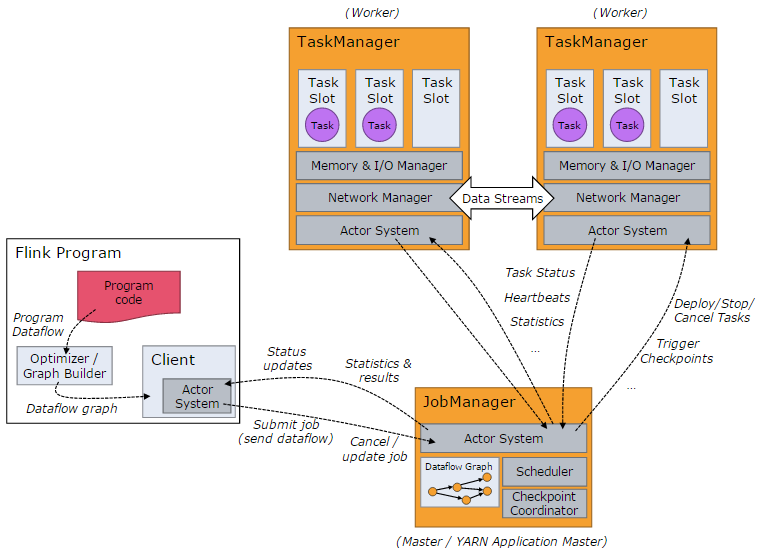

当 Flink 集群启动后，首先会启动一个 JobManger 和一个或多个的 TaskManager。由 Client 提交任务给 JobManager，JobManager 再调度任务到各个 TaskManager 去执行，然后 TaskManager 将心跳和统计信息汇报给 JobManager。TaskManager 之间以流的形式进行数据的传输。上述三者均为独立的 JVM 进程。

- **Client** 为提交 Job 的客户端，可以是运行在任何机器上（与 JobManager 环境连通即可）。提交 Job 后，Client 可以结束进程（Streaming的任务），也可以不结束并等待结果返回。
- **JobManager** 主要负责调度 Job 并协调 Task 做 checkpoint，职责上很像 Storm 的 Nimbus。从 Client 处接收到 Job 和 JAR 包等资源后，会生成优化后的执行计划，并以 Task 的单元调度到各个 TaskManager 去执行。
- **TaskManager** 在启动的时候就设置好了槽位数（Slot），每个 slot 能启动一个 Task，Task 为线程。从 JobManager 处接收需要部署的 Task，部署启动后，与自己的上游建立 Netty 连接，接收数据并处理。


[参考文章1](<http://wuchong.me/blog/2016/05/03/flink-internals-overview/>)

[参考文章2](<http://shiyanjun.cn/archives/1508.html>)


### 讲一下flink的作业执行流程？

 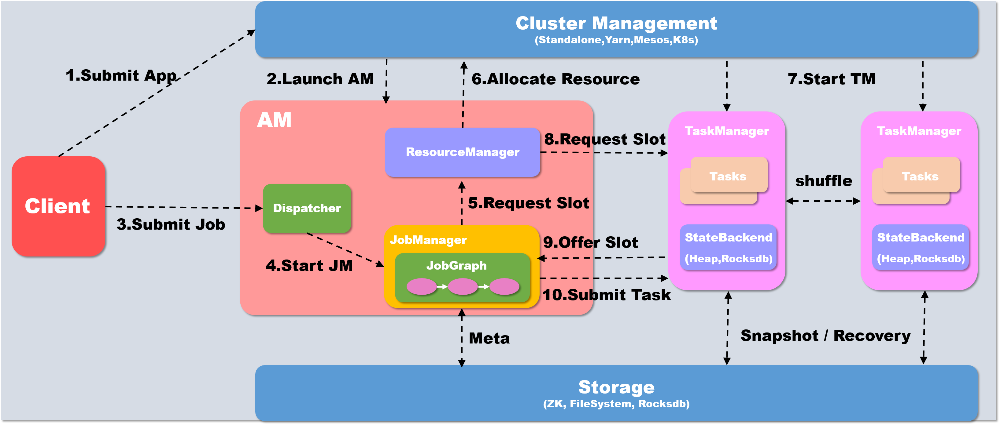

**以yarn模式Per-job方式为例概述作业提交执行流程**

1. 当执行executor() 之后,会首先在本地client 中将代码转化为可以提交的 JobGraph

   如果提交为Per-Job模式,则首先需要启动AM, client会首先向资源系统申请资源, 在yarn下即为申请container开启AM, 如果是Session模式的话则不需要这个步骤

2. Yarn分配资源, 开启AM

3. Client将Job提交给Dispatcher

4. Dispatcher 会开启一个新的 JobManager线程

5. JM 向Flink 自己的 Resourcemanager申请slot资源来执行任务

6. RM 向 Yarn申请资源来启动 TaskManger (Session模式跳过此步)

7. Yarn 分配 Container 来启动 taskManger (Session模式跳过此步)

8. Flink 的 RM 向 TM 申请 slot资源来启动 task

9. TM 将待分配的 slot 提供给 JM

10. JM 提交 task, TM 会启动新的线程来执行任务,开始启动后就可以通过 shuffle模块进行 task之间的数据交换

[参考视频](<https://www.bilibili.com/video/av52394455?t=343>)

### flink具体是如何实现exactly once 语义？

在谈到 flink 所实现的 exactly-once语义时,主要是2个层面上的,首先 flink在0.9版本以后已经实现了基于state的内部一致性语义, 在1.4版本以后也可以实现端到端 Exactly-Once语义

- #### 状态 Exactly-Once

  Flink 提供 exactly-once 的状态（state）投递语义，这为有状态的（stateful）计算提供了准确性保证。也就是状态是不会重复使用的,有且仅有一次消费

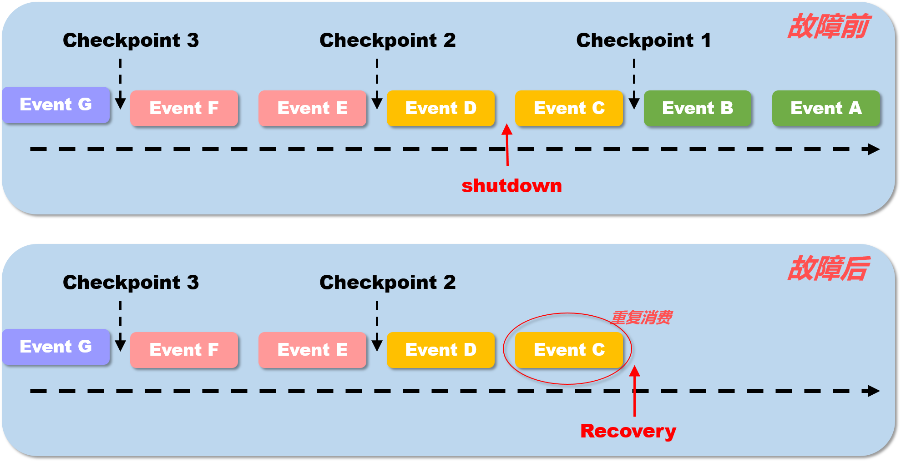

​	这里需要注意的一点是如何理解state语义的exactly-once,并不是说在flink中的所有事件均只会处理一次,而是所有的事件所影响生成的state只有作用一次.

​	在上图中, 假设每两条消息后出发一次checkPoint操作,持久化一次state. TaskManager 在 处理完 event c 之后被shutdown, 这时候当 JobManager重启task之后, TaskManager  会从 checkpoint 1 处恢复状态,重新执行流处理,也就是说 此时 event c 事件 的的确确是会被再一次处理的. 那么 这里所说的一致性语义是何意思呢? 本身,flink每处理完一条数据都会记录当前进度到 state中, 也就是说在 故障前, 处理完 event c 这件事情已经记录到了state中,但是,由于在checkPoint 2 之前, 就已经发生了宕机,那么 event c 对于state的影响并没有被记录下来,对于整个flink内部系统来说就好像没有发生过一样, 在 故障恢复后, 当触发 checkpoint 2 时, event c 的 state才最终被保存下来. **所以说,可以这样理解, 进入flink 系统中的 事件 永远只会被 一次state记录并checkpoint下来,而state是永远不会发生重复被消费的, 这也就是 flink内部的一致性语义,就叫做 状态 Exactly once.**


- #### 端到端（end-to-end）Exactly-Once

2017年12月份发布的Apache Flink 1.4版本，引进了一个重要的特性：TwoPhaseCommitSinkFunction.，它抽取了两阶段提交协议的公共部分，使得构建端到端Excatly-Once的Flink程序变为了可能。这些外部系统包括Kafka0.11及以上的版本，以及一些其他的数据输入（data sources）和数据接收(data sink)。它提供了一个抽象层，需要用户自己手动去实现Exactly-Once语义.

为了提供端到端Exactly-Once语义，除了Flink应用程序本身的状态，Flink写入的外部存储也需要满足这个语义。也就是说，这些外部系统必须提供提交或者回滚的方法，然后通过Flink的checkpoint来协调

[参考文章1](<https://www.whitewood.me/2018/10/16/Flink-Exactly-Once-%E6%8A%95%E9%80%92%E5%AE%9E%E7%8E%B0%E6%B5%85%E6%9E%90/>)

[参考文章2](<https://my.oschina.net/u/992559/blog/1819948>)

### flink 的 window 实现机制？

Flink 中定义一个窗口主要需要以下三个组件。

- **Window Assigner：**用来决定某个元素被分配到哪个/哪些窗口中去。
- **Trigger：**触发器。决定了一个窗口何时能够被计算或清除，每个窗口都会拥有一个自己的Trigger。
- **Evictor：**可以译为“驱逐者”。在Trigger触发之后，在窗口被处理之前，Evictor（如果有Evictor的话）会用来剔除窗口中不需要的元素，相当于一个filter。


#### Window 的实现


首先上图中的组件都位于一个算子（window operator）中，数据流源源不断地进入算子，每一个到达的元素都会被交给 WindowAssigner。WindowAssigner 会决定元素被放到哪个或哪些窗口（window），可能会创建新窗口。因为一个元素可以被放入多个窗口中，所以同时存在多个窗口是可能的。注意，`Window`本身只是一个ID标识符，其内部可能存储了一些元数据，如`TimeWindow`中有开始和结束时间，但是并不会存储窗口中的元素。窗口中的元素实际存储在 Key/Value State 中，key为`Window`，value为元素集合（或聚合值）。为了保证窗口的容错性，该实现依赖了 Flink 的 State 机制（参见 [state 文档](https://ci.apache.org/projects/flink/flink-docs-master/apis/streaming/state.html)）。

每一个窗口都拥有一个属于自己的 Trigger，Trigger上会有定时器，用来决定一个窗口何时能够被计算或清除。每当有元素加入到该窗口，或者之前注册的定时器超时了，那么Trigger都会被调用。Trigger的返回结果可以是 continue（不做任何操作），fire（处理窗口数据），purge（移除窗口和窗口中的数据），或者 fire + purge。一个Trigger的调用结果只是fire的话，那么会计算窗口并保留窗口原样，也就是说窗口中的数据仍然保留不变，等待下次Trigger fire的时候再次执行计算。一个窗口可以被重复计算多次知道它被 purge 了。在purge之前，窗口会一直占用着内存。

当Trigger fire了，窗口中的元素集合就会交给`Evictor`（如果指定了的话）。Evictor 主要用来遍历窗口中的元素列表，并决定最先进入窗口的多少个元素需要被移除。剩余的元素会交给用户指定的函数进行窗口的计算。如果没有 Evictor 的话，窗口中的所有元素会一起交给函数进行计算。

计算函数收到了窗口的元素（可能经过了 Evictor 的过滤），并计算出窗口的结果值，并发送给下游。窗口的结果值可以是一个也可以是多个。DataStream API 上可以接收不同类型的计算函数，包括预定义的`sum()`,`min()`,`max()`，还有 `ReduceFunction`，`FoldFunction`，还有`WindowFunction`。WindowFunction 是最通用的计算函数，其他的预定义的函数基本都是基于该函数实现的。

Flink 对于一些聚合类的窗口计算（如sum,min）做了优化，因为聚合类的计算不需要将窗口中的所有数据都保存下来，只需要保存一个result值就可以了。每个进入窗口的元素都会执行一次聚合函数并修改result值。这样可以大大降低内存的消耗并提升性能。但是如果用户定义了 Evictor，则不会启用对聚合窗口的优化，因为 Evictor 需要遍历窗口中的所有元素，必须要将窗口中所有元素都存下来。


[参考文章](<http://wuchong.me/blog/2016/05/25/flink-internals-window-mechanism/>)

### flink的window分类？

**flink中的窗口主要分为3大类共5种窗口**:

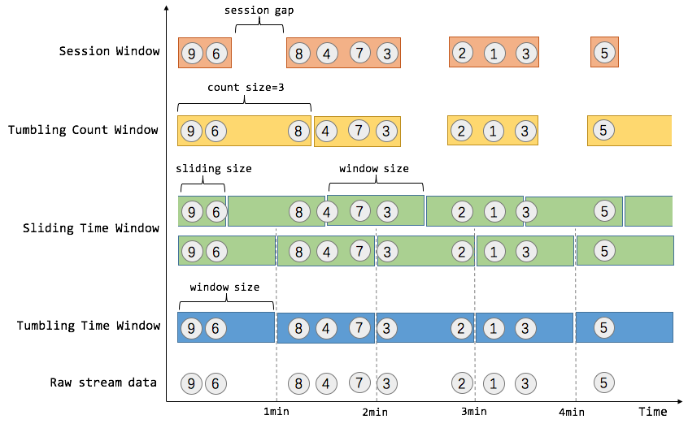

- **Time Window 时间窗口**

  - **Tumbing Time Window 滚动时间窗口**

    实现统计每一分钟(或其他长度)窗口内 计算的效果

  - **Sliding Time Window 滑动时间窗口**

    实现每过xxx时间 统计 xxx时间窗口的效果. 比如，我们可以每30秒计算一次最近一分钟用户购买的商品总数。

- **Count Window 计数窗口**

  - **Tumbing Count Window  滚动计数窗口**

    当我们想要每100个用户购买行为事件统计购买总数，那么每当窗口中填满100个元素了，就会对窗口进行计算，这种窗口我们称之为翻滚计数窗口（Tumbling Count Window）

  - **Sliding Count Window   滑动计数窗口**

    和Sliding Time Window含义是类似的，例如计算每10个元素计算一次最近100个元素的总和

- **Session Window  会话窗口**

  在这种用户交互事件流中，我们首先想到的是将事件聚合到会话窗口中（一段用户持续活跃的周期），由非活跃的间隙分隔开。如上图所示，就是需要计算每个用户在活跃期间总共购买的商品数量，如果用户30秒没有活动则视为会话断开（假设raw data stream是单个用户的购买行为流）

### flink 的 state 存储？

Apache Flink内部有四种state的存储实现，具体如下：

- **基于内存的HeapStateBackend** - 在debug模式使用，不 建议在生产模式下应用；
- **基于HDFS的FsStateBackend** - 分布式文件持久化，每次读写都产生网络IO，整体性能不佳；
- **基于RocksDB的RocksDBStateBackend** - 本地文件+异步HDFS持久化；
- **基于Niagara(Alibaba内部实现)NiagaraStateBackend** - 分布式持久化- 在Alibaba生产环境应用；


[参考文章](<https://juejin.im/post/5c87dbdbe51d45494c77d607>)

### flink是如何实现反压的？

flink的反压经历了两个发展阶段,分别是基于TCP的反压(<1.5)和基于credit的反压(>1.5)

- #### 基于 TCP 的反压

  flink中的消息发送通过RS(ResultPartition),消息接收通过IC(InputGate),两者的数据都是以 LocalBufferPool的形式来存储和提取,进一步的依托于Netty的NetworkBufferPool,之后更底层的便是依托于TCP的滑动窗口机制,当IC端的buffer池满了之后,两个task之间的滑动窗口大小便为0,此时RS端便无法再发送数据

  基于TCP的反压最大的问题是会造成整个TaskManager端的反压,所有的task都会受到影响

- #### 基于 Credit 的反压

  RS与IC之间通过backlog和credit来确定双方可以发送和接受的数据量的大小以提前感知,而不是通过TCP滑动窗口的形式来确定buffer的大小之后再进行反压

  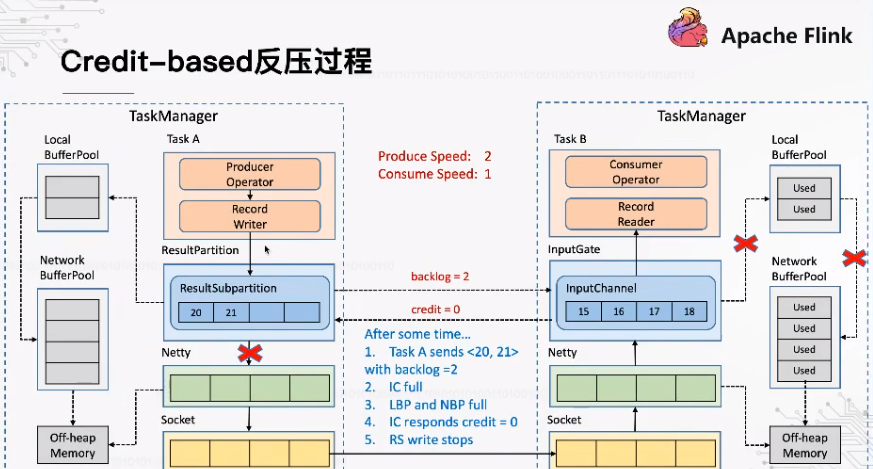


[参考视频](<https://www.bilibili.com/video/av55487329>)

[参考文章1](<https://blog.csdn.net/u010376788/article/details/92086752>)

[参考文章2](<https://blog.csdn.net/u010376788/article/details/95047250>)


### flink的部署模式都有哪些？

**flink可以以多种方式部署,包括standlone模式/yarn/Mesos/Kubernetes/Docker/AWS/Google Compute Engine/MAPR等**


一般公司中主要采用 on yarn模式

### 讲一下flink on yarn的部署？

Flink作业提交有两种类型:

- #### yarn session

  需要先启动集群，然后在提交作业，接着会向yarn申请一块空间后，资源永远保持不变。如果资源满了，下一个作业就无法提交，只能等到yarn中的其中一个作业执行完成后，释放了资源，那下一个作业才会正常提交.

  - 客户端模式

    对于客户端模式而言，你可以启动多个yarn session，一个yarn session模式对应一个JobManager,并按照需求提交作业，同一个Session中可以提交多个Flink作业。如果想要停止Flink Yarn Application，需要通过yarn application -kill命令来停止.

  - 分离式模式

    对于分离式模式，并不像客户端那样可以启动多个yarn session，如果启动多个，会出现下面的session一直处在等待状态。JobManager的个数只能是一个，同一个Session中可以提交多个Flink作业。如果想要停止Flink Yarn Application，需要通过yarn application -kill命令来停止

- #### Flink run(Per-Job)

  直接在YARN上提交运行Flink作业(Run a Flink job on YARN)，这种方式的好处是一个任务会对应一个job,即没提交一个作业会根据自身的情况，向yarn申请资源，直到作业执行完成，并不会影响下一个作业的正常运行，除非是yarn上面没有任何资源的情况下

| Session                          |                                  |
| -------------------------------- | -------------------------------- |
| 共享Dispatcher和Resource Manager | Dispatcher和Resource Manager     |
| 共享资源(即 TaskExecutor)        | 按需要申请资源 (即 TaskExecutor) |
| 适合规模小,执行时间短的作业      |                                  |

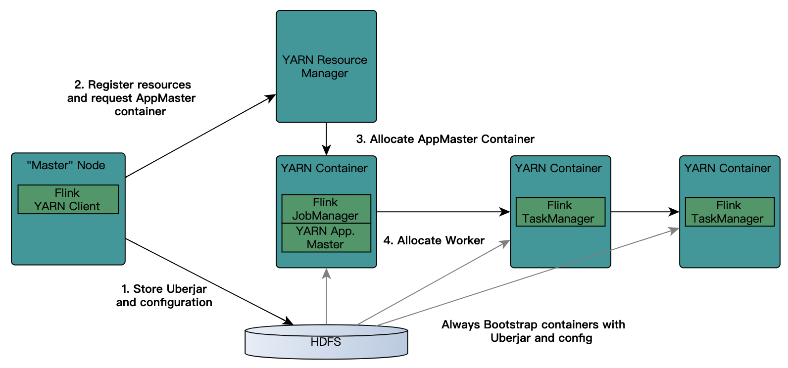


### flink中的时间概念 , eventTime 和 processTime的区别？

Flink中有三种时间概念,分别是 Processing Time、Event Time 和 Ingestion Time

- #### Processing Time

  Processing Time 是指事件被处理时机器的系统时间。

  当流程序在 Processing Time 上运行时，所有基于时间的操作(如时间窗口)将使用当时机器的系统时间。每小时 Processing Time 窗口将包括在系统时钟指示整个小时之间到达特定操作的所有事件

- #### Event Time

  Event Time 是事件发生的时间，一般就是数据本身携带的时间。这个时间通常是在事件到达 Flink 之前就确定的，并且可以从每个事件中获取到事件时间戳。在 Event Time 中，时间取决于数据，而跟其他没什么关系。Event Time 程序必须指定如何生成 Event Time 水印，这是表示 Event Time 进度的机制

- #### Ingestion Time

  Ingestion Time 是事件进入 Flink 的时间。 在源操作处，每个事件将源的当前时间作为时间戳，并且基于时间的操作（如时间窗口）会利用这个时间戳

  Ingestion Time 在概念上位于 Event Time 和 Processing Time 之间。 与 Processing Time 相比，它稍微贵一些，但结果更可预测。因为 Ingestion Time 使用稳定的时间戳（在源处分配一次），所以对事件的不同窗口操作将引用相同的时间戳，而在 Processing Time 中，每个窗口操作符可以将事件分配给不同的窗口（基于机器系统时间和到达延迟）

  与 Event Time 相比，Ingestion Time 程序无法处理任何无序事件或延迟数据，但程序不必指定如何生成水印

  

[参考文章](<https://zhuanlan.zhihu.com/p/55322400>)

### flink中的session Window怎样使用？

会话窗口主要是将某段时间内活跃度较高的数据聚合成一个窗口进行计算,窗口的触发条件是 Session Gap, 是指在规定的时间内如果没有数据活跃接入,则认为窗口结束,然后触发窗口结果

Session Windows窗口类型比较适合非连续性数据处理或周期性产生数据的场景,根据用户在线上某段时间内的活跃度对用户行为进行数据统计

```
val sessionWindowStream = inputStream
.keyBy(_.id)
//使用EventTimeSessionWindow 定义 Event Time 滚动窗口
.window(EventTimeSessionWindow.withGap(Time.milliseconds(10)))
.process(......)
```

Session Window 本质上没有固定的起止时间点,因此底层计算逻辑和Tumbling窗口及Sliding 窗口有一定的区别,

Session Window 为每个进入的数据都创建了一个窗口,最后再将距离窗口Session Gap 最近的窗口进行合并,然后计算窗口结果

### flink中的session Window怎样使用

会话窗口主要是将某段时间内活跃度较高的数据聚合成一个窗口进行计算,窗口的触发条件是 Session Gap, 是指在规定的时间内如果没有数据活跃接入,则认为窗口结束,然后触发窗口结果

Session Windows窗口类型比较适合非连续性数据处理或周期性产生数据的场景,根据用户在线上某段时间内的活跃度对用户行为进行数据统计

```
val sessionWindowStream = inputStream
.keyBy(_.id)
//使用EventTimeSessionWindow 定义 Event Time 滚动窗口
.window(EventTimeSessionWindow.withGap(Time.milliseconds(10)))
.process(......)
```

Session Window 本质上没有固定的起止时间点,因此底层计算逻辑和Tumbling窗口及Sliding 窗口有一定的区别,

Session Window 为每个进入的数据都创建了一个窗口,最后再将距离窗口Session Gap 最近的窗口进行合并,然后计算窗口结果


## HBase

###  Hbase 架构


**Hbase主要包含HMaster/HRegionServer/Zookeeper**

- **HRegionServer 负责实际数据的读写. 当访问数据时, 客户端直接与RegionServer通信.**

  HBase的表根据Row Key的区域分成多个Region, 一个Region包含这这个区域内所有数据. 而Region server负责管理多个Region, 负责在这个Region server上的所有region的读写操作. 

- **HMaster 负责管理Region的位置, DDL(新增和删除表结构)**

  - 协调RegionServer
  - 在集群处于数据恢复或者动态调整负载时,分配Region到某一个RegionServer中
  - 管控集群,监控所有Region Server的状态
  - 提供DDL相关的API, 新建(create),删除(delete)和更新(update)表结构.

- **Zookeeper 负责维护和记录整个Hbase集群的状态**

  zookeeper探测和记录Hbase集群中服务器的状态信息.如果zookeeper发现服务器宕机,它会通知Hbase的master节点.

### hbase 如何设计 rowkey？

- **RowKey长度原则**

  Rowkey是一个二进制码流，Rowkey的长度被很多开发者建议说设计在10~100个字节，不过建议是越短越好，不要超过16个字节。

  原因如下：

  - 数据的持久化文件HFile中是按照KeyValue存储的，如果Rowkey过长比如100个字节，1000万列数据光Rowkey就要占用100*1000万=10亿个字节，将近1G数据，这会极大影响HFile的存储效率；
  - MemStore将缓存部分数据到内存，如果Rowkey字段过长内存的有效利用率会降低，系统将无法缓存更多的数据，这会降低检索效率。因此Rowkey的字节长度越短越好。
  - 目前操作系统是都是64位系统，内存8字节对齐。控制在16个字节，8字节的整数倍利用操作系统的最佳特性。

- **RowKey散列原则**

  如果Rowkey是按时间戳的方式递增，不要将时间放在二进制码的前面，建议将Rowkey的高位作为散列字段，由程序循环生成，低位放时间字段，这样将提高数据均衡分布在每个Regionserver实现负载均衡的几率。如果没有散列字段，首字段直接是时间信息将产生所有新数据都在一个RegionServer上堆积的热点现象，这样在做数据检索的时候负载将会集中在个别RegionServer，降低查询效率。

- **RowKey唯一原则**

  必须在设计上保证其唯一性。

[参考文章1](<https://zhuanlan.zhihu.com/p/30074408>)

[参考文章2](<http://www.nosqlnotes.com/technotes/hbase/hbase-rowkey-design/>)


### hbase的存储结构

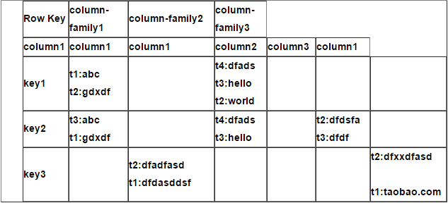

**Hbase的优点及应用场景**:

1. 半结构化或非结构化数据: 
   对于数据结构字段不够确定或杂乱无章非常难按一个概念去进行抽取的数据适合用HBase，因为HBase支持动态添加列。
2. 记录很稀疏： 
   RDBMS的行有多少列是固定的。为null的列浪费了存储空间。HBase为null的Column不会被存储，这样既节省了空间又提高了读性能。
3. 多版本号数据： 
   依据Row key和Column key定位到的Value能够有随意数量的版本号值，因此对于须要存储变动历史记录的数据，用HBase是很方便的。比方某个用户的Address变更，用户的Address变更记录也许也是具有研究意义的。
4. 仅要求最终一致性： 
   对于数据存储事务的要求不像金融行业和财务系统这么高，只要保证最终一致性就行。（比如HBase+elasticsearch时，可能出现数据不一致）
5. 高可用和海量数据以及很大的瞬间写入量： 
   WAL解决高可用，支持PB级数据，put性能高
   适用于插入比查询操作更频繁的情况。比如，对于历史记录表和日志文件。（HBase的写操作更加高效）
6. 业务场景简单： 
   不需要太多的关系型数据库特性，列入交叉列，交叉表，事务，连接等。

**Hbase的缺点：**

1. 单一RowKey固有的局限性决定了它不可能有效地支持多条件查询
2. 不适合于大范围扫描查询
3. 不直接支持 SQL 的语句查询


[参考文章1](<https://www.iteye.com/blog/forlan-2364661>)

[参考文章2](<https://blog.csdn.net/liaynling/article/details/81199238>)

[参考文章3](<https://juejin.im/post/5c31cf486fb9a04a102f6f89#heading-2>)


### hbase的HA实现,zookeeper在其中的作用？

 HBase中可以启动多个HMaster，通过Zookeeper的Master Election机制保证总有一个Master运行。
配置HBase高可用，只需要启动两个HMaster，让Zookeeper自己去选择一个Master Acitve即可

zk的在这里起到的作用就是用来管理master节点,以及帮助hbase做master选举


### HMaster宕机的时候,哪些操作还能正常工作？

对表内数据的增删查改是可以正常进行的,因为hbase client 访问数据只需要通过 zookeeper 来找到 rowkey 的具体 region 位置即可. 但是对于创建表/删除表等的操作就无法进行了,因为这时候是需要HMaster介入, 并且region的拆分,合并,迁移等操作也都无法进行了


### hbase的写数据的流程？

1. Client先访问zookeeper，从.META.表获取相应region信息，然后从meta表获取相应region信息 
2. 根据namespace、表名和rowkey根据meta表的数据找到写入数据对应的region信息 
3. 找到对应的regionserver 把数据先写到WAL中，即HLog，然后写到MemStore上 
4. MemStore达到设置的阈值后则把数据刷成一个磁盘上的StoreFile文件。 
5. 当多个StoreFile文件达到一定的大小后(这个可以称之为小合并，合并数据可以进行设置，必须大于等于2，小于10——hbase.hstore.compaction.max和hbase.hstore.compactionThreshold，默认为10和3)，会触发Compact合并操作，合并为一个StoreFile，（这里同时进行版本的合并和数据删除。） 
6. 当Storefile大小超过一定阈值后，会把当前的Region分割为两个（Split）【可称之为大合并，该阈值通过hbase.hregion.max.filesize设置，默认为10G】，并由Hmaster分配到相应的HRegionServer，实现负载均衡

### hbase读数据的流程？

1. 首先，客户端需要获知其想要读取的信息的Region的位置，这个时候，Client访问hbase上数据时并不需要Hmaster参与（HMaster仅仅维护着table和Region的元数据信息，负载很低），只需要访问zookeeper，从meta表获取相应region信息(地址和端口等)。【Client请求ZK获取.META.所在的RegionServer的地址。】
2. 客户端会将该保存着RegionServer的位置信息的元数据表.META.进行缓存。然后在表中确定待检索rowkey所在的RegionServer信息（得到持有对应行键的.META表的服务器名）。【获取访问数据所在的RegionServer地址】
3. 根据数据所在RegionServer的访问信息，客户端会向该RegionServer发送真正的数据读取请求。服务器端接收到该请求之后需要进行复杂的处理。
4. 先从MemStore找数据，如果没有，再到StoreFile上读(为了读取的效率)。

[参考文章1](<https://blog.csdn.net/HaixWang/article/details/79520141#%E8%AF%BB%E6%B5%81%E7%A8%8B%E6%A6%82%E8%A7%88>)

[参考文章2](<http://hbasefly.com/2016/12/21/hbase-getorscan/?rkfcfo=fy6gy1>)


## Kafka

### kafka 的架构？


### kafka 与其他消息组件对比？

[推荐阅读文章](<https://github.com/doocs/advanced-java/blob/master/docs/high-concurrency/why-mq.md>)

| 特性                     | ActiveMQ                              | RabbitMQ                                           | RocketMQ                                                     | Kafka                                                        |
| ------------------------ | ------------------------------------- | -------------------------------------------------- | ------------------------------------------------------------ | ------------------------------------------------------------ |
| 单机吞吐量               | 万级，比 RocketMQ、Kafka 低一个数量级 | 同 ActiveMQ                                        | 10 万级，支撑高吞吐                                          | 10 万级，高吞吐，一般配合大数据类的系统来进行实时数据计算、日志采集等场景 |
| topic 数量对吞吐量的影响 |                                       |                                                    | topic 可以达到几百/几千的级别，吞吐量会有较小幅度的下降，这是 RocketMQ 的一大优势，在同等机器下，可以支撑大量的 topic | topic 从几十到几百个时候，吞吐量会大幅度下降，在同等机器下，Kafka 尽量保证 topic 数量不要过多，如果要支撑大规模的 topic，需要增加更多的机器资源 |
| 时效性                   | ms 级                                 | 微秒级，这是 RabbitMQ 的一大特点，延迟最低         | ms 级                                                        | 延迟在 ms 级以内                                             |
| 可用性                   | 高，基于主从架构实现高可用            | 同 ActiveMQ                                        | 非常高，分布式架构                                           | 非常高，分布式，一个数据多个副本，少数机器宕机，不会丢失数据，不会导致不可用 |
| 消息可靠性               | 有较低的概率丢失数据                  | 基本不丢                                           | 经过参数优化配置，可以做到 0 丢失                            | 同 RocketMQ                                                  |
| 功能支持                 | MQ 领域的功能极其完备                 | 基于 erlang 开发，并发能力很强，性能极好，延时很低 | MQ 功能较为完善，还是分布式的，扩展性好                      | 功能较为简单，主要支持简单的 MQ 功能，在大数据领域的实时计算以及日志采集被大规模使用 |


### kafka 实现高吞吐的原理？

- 读写文件依赖OS文件系统的页缓存，而不是在JVM内部缓存数据，利用OS来缓存，内存利用率高
- sendfile技术（零拷贝），避免了传统网络IO四步流程
- 支持End-to-End的压缩
- 顺序IO以及常量时间get、put消息
- Partition 可以很好的横向扩展和提供高并发处理


[参考文章1](<https://www.jianshu.com/p/d6a73be9d803>)

[参考文章2](<https://blog.csdn.net/stark_summer/article/details/50144591>)

### kafka怎样保证不重复消费？

此问题其实等价于保证消息队列消费的幂等性

主要需要结合实际业务来操作:

- 比如你拿个数据要写库，你先根据主键查一下，如果这数据都有了，你就别插入了，update 一下好吧。
- 比如你是写 Redis，那没问题了，反正每次都是 set，天然幂等性。
- 比如你不是上面两个场景，那做的稍微复杂一点，你需要让生产者发送每条数据的时候，里面加一个全局唯一的 id，类似订单 id 之类的东西，然后你这里消费到了之后，先根据这个 id 去比如 Redis 里查一下，之前消费过吗？如果没有消费过，你就处理，然后这个 id 写 Redis。如果消费过了，那你就别处理了，保证别重复处理相同的消息即可。
- 比如基于数据库的唯一键来保证重复数据不会重复插入多条。因为有唯一键约束了，重复数据插入只会报错，不会导致数据库中出现脏数据。


[参考文章](<https://github.com/doocs/advanced-java/blob/master/docs/high-concurrency/how-to-ensure-that-messages-are-not-repeatedly-consumed.md>)


### kafka怎样保证不丢失消息？

#### 消费端弄丢了数据

唯一可能导致消费者弄丢数据的情况，就是说，你消费到了这个消息，然后消费者那边**自动提交了 offset**，让 Kafka 以为你已经消费好了这个消息，但其实你才刚准备处理这个消息，你还没处理，你自己就挂了，此时这条消息就丢咯。

这不是跟 RabbitMQ 差不多吗，大家都知道 Kafka 会自动提交 offset，那么只要**关闭自动提交** offset，在处理完之后自己手动提交 offset，就可以保证数据不会丢。但是此时确实还是**可能会有重复消费**，比如你刚处理完，还没提交 offset，结果自己挂了，此时肯定会重复消费一次，自己保证幂等性就好了。

生产环境碰到的一个问题，就是说我们的 Kafka 消费者消费到了数据之后是写到一个内存的 queue 里先缓冲一下，结果有的时候，你刚把消息写入内存 queue，然后消费者会自动提交 offset。然后此时我们重启了系统，就会导致内存 queue 里还没来得及处理的数据就丢失了。

#### Kafka 弄丢了数据

这块比较常见的一个场景，就是 Kafka 某个 broker 宕机，然后重新选举 partition 的 leader。大家想想，要是此时其他的 follower 刚好还有些数据没有同步，结果此时 leader 挂了，然后选举某个 follower 成 leader 之后，不就少了一些数据？这就丢了一些数据啊。

生产环境也遇到过，我们也是，之前 Kafka 的 leader 机器宕机了，将 follower 切换为 leader 之后，就会发现说这个数据就丢了。

所以此时一般是要求起码设置如下 4 个参数：

- 给 topic 设置 `replication.factor` 参数：这个值必须大于 1，要求每个 partition 必须有至少 2 个副本。
- 在 Kafka 服务端设置 `min.insync.replicas` 参数：这个值必须大于 1，这个是要求一个 leader 至少感知到有至少一个 follower 还跟自己保持联系，没掉队，这样才能确保 leader 挂了还有一个 follower 吧。
- 在 producer 端设置 `acks=all`：这个是要求每条数据，必须是**写入所有 replica 之后，才能认为是写成功了**。
- 在 producer 端设置 `retries=MAX`（很大很大很大的一个值，无限次重试的意思）：这个是**要求一旦写入失败，就无限重试**，卡在这里了。

我们生产环境就是按照上述要求配置的，这样配置之后，至少在 Kafka broker 端就可以保证在 leader 所在 broker 发生故障，进行 leader 切换时，数据不会丢失。

#### 生产者会不会弄丢数据？

如果按照上述的思路设置了 `acks=all`，一定不会丢，要求是，你的 leader 接收到消息，所有的 follower 都同步到了消息之后，才认为本次写成功了。如果没满足这个条件，生产者会自动不断的重试，重试无限次。


[参考文章](<https://github.com/doocs/advanced-java/blob/master/docs/high-concurrency/how-to-ensure-the-reliable-transmission-of-messages.md>)


### kafka 与 spark streaming 集成,如何保证 exactly once 语义？

- ### Spark Streaming上游对接kafka时保证Exactly Once

  Spark Streaming使用Direct模式对接上游kafka。无论kafka有多少个partition， 使用Direct模式总能保证SS中有相同数量的partition与之相对， 也就是说SS中的KafkaRDD的并发数量在Direct模式下是由上游kafka决定的。 在这个模式下，kafka的offset是作为KafkaRDD的一部分存在，会存储在checkpoints中， 由于checkpoints只存储offset内容，而不存储数据，这就使得checkpoints是相对轻的操作。 这就使得SS在遇到故障时，可以从checkpoint中恢复上游kafka的offset，从而保证exactly once

- ### Spark Streaming输出下游保证Exactly once

  - 第一种“鸵鸟做法”，就是期望下游（数据）具有幂等特性。

    多次尝试总是写入相同的数据，例如，saveAs***Files 总是将相同的数据写入生成的文件

- - 使用事务更新

    所有更新都是事务性的，以便更新完全按原子进行。这样做的一个方法如下： 使用批处理时间(在foreachRDD中可用)和RDD的partitionIndex（分区索引）来创建identifier（标识符)。 该标识符唯一地标识streaming application 中的blob数据。 使用该identifier，blob 事务地更新到外部系统中。也就是说，如果identifier尚未提交，则以 (atomicall)原子方式提交分区数据和identifier。否则，如果已经提交，请跳过更新。


[参考文章1](<http://www.aihacks.life/post/spark-streaming%E5%A6%82%E4%BD%95%E4%BF%9D%E8%AF%81exactly-once%E8%AF%AD%E4%B9%89/>)

[参考文章2](<https://www.jianshu.com/p/10de8f3b1be8>)

[参考文章3](<https://blog.csdn.net/cymvp/article/details/52605987>)


### ack 有哪几种, 生产中怎样选择？

ack=0/1/-1的不同情况：

- Ack = 0

  producer不等待broker的ack，broker一接收到还没有写入磁盘就已经返回，当broker故障时有可能丢失数据；

- Ack = 1

  producer等待broker的ack，partition的leader落盘成功后返回ack，如果在follower同步成功之前leader故障，那么将会丢失数据；

- Ack = -1

  producer等待broker的ack，partition的leader和follower全部落盘成功后才返回ack，数据一般不会丢失，延迟时间长但是可靠性高。

**生产中主要以 Ack=-1为主,如果压力过大,可切换为Ack=1. Ack=0的情况只能在测试中使用.**


### 如何通过 offset 寻找数据？

如果consumer要找offset是1008的消息，那么，

1，按照二分法找到小于1008的segment，也就是00000000000000001000.log和00000000000000001000.index

2，用目标offset减去文件名中的offset得到消息在这个segment中的偏移量。也就是1008-1000=8，偏移量是8。

3，再次用二分法在index文件中找到对应的索引，也就是第三行6,45。

4，到log文件中，从偏移量45的位置开始（实际上这里的消息offset是1006），顺序查找，直到找到offset为1008的消息。查找期间kafka是按照log的存储格式来判断一条消息是否结束的。

[参考文章](<https://blog.csdn.net/lkforce/article/details/77854813>)


### 如何清理过期数据？

- #### 删除

  log.cleanup.policy=delete启用删除策略

  - 直接删除，删除后的消息不可恢复。可配置以下两个策略：
    清理超过指定时间清理：  
    log.retention.hours=16
  - 超过指定大小后，删除旧的消息：
    log.retention.bytes=1073741824
    为了避免在删除时阻塞读操作，采用了copy-on-write形式的实现，删除操作进行时，读取操作的二分查找功能实际是在一个静态的快照副本上进行的，这类似于Java的CopyOnWriteArrayList。

- #### 压缩

  将数据压缩，只保留每个key最后一个版本的数据。
  首先在broker的配置中设置log.cleaner.enable=true启用cleaner，这个默认是关闭的。
  在topic的配置中设置log.cleanup.policy=compact启用压缩策略。

  

  如上图，在整个数据流中，每个Key都有可能出现多次，压缩时将根据Key将消息聚合，只保留最后一次出现时的数据。这样，无论什么时候消费消息，都能拿到每个Key的最新版本的数据。
  压缩后的offset可能是不连续的，比如上图中没有5和7，因为这些offset的消息被merge了，当从这些offset消费消息时，将会拿到比这个offset大的offset对应的消息，比如，当试图获取offset为5的消息时，实际上会拿到offset为6的消息，并从这个位置开始消费。
  这种策略只适合特俗场景，比如消息的key是用户ID，消息体是用户的资料，通过这种压缩策略，整个消息集里就保存了所有用户最新的资料。
  压缩策略支持删除，当某个Key的最新版本的消息没有内容时，这个Key将被删除，这也符合以上逻辑。


[参考文章](<https://blog.csdn.net/honglei915/article/details/49683065>)


### 1条message中包含哪些信息？

| **Field**  | Description                                                  |
| ---------- | ------------------------------------------------------------ |
| Attributes | 该字节包含有关消息的元数据属性。 最低的2位包含用于消息的压缩编解码器。 其他位应设置为0。 |
| Crc        | CRC是消息字节的其余部分的CRC32。 这用于检查代理和使用者上的消息的完整性。 |
|            | key是用于分区分配的可选参数。 key可以为null。                |
| MagicByte  | 这是用于允许向后兼容的消息二进制格式演变的版本ID。 当前值为0。 |
| Offset     | 这是kafka中用作日志序列号的偏移量。 当producer发送消息时，它实际上并不知道偏移量，并且可以填写它喜欢的任何值。 |
| Value      | 该值是实际的消息内容，作为不透明的字节数组。 Kafka支持递归消息，在这种情况下，它本身可能包含消息集。 消息可以为null。 |


### 讲一下zookeeper在kafka中的作用？


#### zk的作用主要有如下几点:

1. kafka的元数据都存放在zk上面,由zk来管理
2. 0.8之前版本的kafka, consumer的消费状态，group的管理以及 offset的值都是由zk管理的,现在offset会保存在本地topic文件里
3. 负责borker的lead选举和管理


### kafka 可以脱离 zookeeper 单独使用吗？

kafka 不能脱离 zookeeper 单独使用，因为 kafka 使用 zookeeper 管理和协调 kafka 的节点服务器。

### kafka有几种数据保留策略？

kafka 有两种数据保存策略：按照过期时间保留和按照存储的消息大小保留。

### kafka同时设置了7天和10G清除数据,到第5天的时候消息到达了10G,这个时候kafka如何处理？

这个时候 kafka 会执行数据清除工作，时间和大小不论那个满足条件，都会清空数据。


## Zookeeper

### zookeeper是什么,都有哪些功能？


### zk 有几种部署模式？

zookeeper有两种运行模式: 集群模式和单机模式,还有一种伪集群模式,在单机模式下模拟集群的zookeeper服务

### zk 是怎样保证主从节点的状态同步？

zookeeper 的核心是原子广播，这个机制保证了各个 server 之间的同步。实现这个机制的协议叫做 zab 协议。 zab 协议有两种模式，分别是恢复模式（选主）和广播模式（同步）。当服务启动或者在领导者崩溃后，zab 就进入了恢复模式，当领导者被选举出来，且大多数 server 完成了和 leader 的状态同步以后，恢复模式就结束了。状态同步保证了 leader 和 server 具有相同的系统状态。

### 说一下 zk 的通知机制？

客户端端会对某个 znode 建立一个 watcher 事件，当该 znode 发生变化时，这些客户端会收到 zookeeper 的通知，然后客户端可以根据 znode 变化来做出业务上的改变

### zk 的分布式锁实现方式？

使用zookeeper实现分布式锁的算法流程，假设锁空间的根节点为/lock：

1. 客户端连接zookeeper，并在/lock下创建**临时的**且**有序的**子节点，第一个客户端对应的子节点为/lock/lock-0000000000，第二个为/lock/lock-0000000001，以此类推。
2. 客户端获取/lock下的子节点列表，判断自己创建的子节点是否为当前子节点列表中**序号最小**的子节点，如果是则认为获得锁，否则**监听刚好在自己之前一位的子节点删除消息**，获得子节点变更通知后重复此步骤直至获得锁；
3. 执行业务代码；
4. 完成业务流程后，删除对应的子节点释放锁。

[参考文章](<http://www.dengshenyu.com/java/%E5%88%86%E5%B8%83%E5%BC%8F%E7%B3%BB%E7%BB%9F/2017/10/23/zookeeper-distributed-lock.html>)

### 分布式一致性协议

常见的分布式一致性协议有: 两阶段提交协议，三阶段提交协议，向量时钟，RWN协议，paxos协议，Raft协议. zk采用的是paxos协议.

#### 两阶段提交协议(2PC)

两阶段提交协议，简称2PC，是比较常用的解决分布式事务问题的方式，要么所有参与进程都提交事务，要么都取消事务，即实现ACID中的原子性(A)的常用手段。

#### 三阶段提交协议(3PC)

3PC就是在2PC基础上将2PC的提交阶段细分位两个阶段：预提交阶段和提交阶段

#### 向量时钟

通过向量空间祖先继承的关系比较, 使数据保持最终一致性,这就是向量时钟的基本定义。

#### NWR协议

NWR是一种在分布式存储系统中用于控制一致性级别的一种策略。在Amazon的Dynamo云存储系统中，就应用NWR来控制一致性。
让我们先来看看这三个字母的含义：
N：在分布式存储系统中，有多少份备份数据
W：代表一次成功的更新操作要求至少有w份数据写入成功
R： 代表一次成功的读数据操作要求至少有R份数据成功读取
NWR值的不同组合会产生不同的一致性效果，当W+R>N的时候，整个系统对于客户端来讲能保证强一致性。当W+R 以常见的N=3、W=2、R=2为例：
N=3，表示，任何一个对象都必须有三个副本（Replica），W=2表示，对数据的修改操作（Write）只需要在3个Replica中的2个上面完成就返回，R=2表示，从三个对象中要读取到2个数据对象，才能返回。
在分布式系统中，数据的单点是不允许存在的。即线上正常存在的Replica数量是1的情况是非常危险的，因为一旦这个Replica再次错误，就 可能发生数据的永久性错误。假如我们把N设置成为2，那么，只要有一个存储节点发生损坏，就会有单点的存在。所以N必须大于2。N约高，系统的维护和整体 成本就越高。工业界通常把N设置为3。
当W是2、R是2的时候，W+R>N，这种情况对于客户端就是强一致性的。

#### paxos协议

Paxos算法是**Lamport**于1990年提出的一种基于**消息传递的一致性算法**，

- <font color="red">数据库高可用性难题</font>
  - 痛点：如何处理主备库之间的数据同步。
  - 如何选择主节点
- 基本需求：
  - 数据不丢失
  - 服务持续可用
  - 自动的主备切换
- 目标：**谋求尽早形成多数派**

[https://zh.wikipedia.org/wiki/Paxos%E7%AE%97%E6%B3%95](https://zh.wikipedia.org/wiki/Paxos算法)

https://www.zhihu.com/question/19787937/answer/107750652

[架构师需要了解的Paxos原理，历程及实践](<http://chuansong.me/n/2189245>)

#### Raft协议

Raft是一个通过管理一个副本日志的一致性算法。它提供了跟(multi-)Paxos一样有效的功能，但是它的架构和Paxos不一样；它比Paxos更加容易理解，并且能用于生产环境中。为了加强理解，raft把一致性的问题分成了三个子问题，例如**leader election, log replication, and safety**,在Raft集群中，**有且仅有一个Leader**，在Leader运行正常的情况下，一个节点服务器要么就是Leader，要么就是Follower。Follower直到Leader故障了，才有可能变成candidate。

<font color="red">**角色：**</font>

- **follower**
- **leader**
- **candidate：**If followers don't hear from a leader then they can become a candidate.

<font color="red">**子问题：**</font>

- Leader Election.
- Log Replication
- 

*In Search of an Understandable Consensus Algorithm*[^10]

https://raft.github.io/

[Raft协议的动画](<http://thesecretlivesofdata.com/raft/>)

<font color="red">**视频教程**</font>



[参考文章](<https://blog.csdn.net/chdhust/article/details/52651741>)

### 讲一下leader 选举过程？


## 引用

[^1]:Vinod  Kumar Vavilapalli, Arun C. Murthy, Chris Douglas, Sharad Agarwal, &  Eric Baldeschwieler. (2013). Apache Hadoop YARN: yet another resource  negotiator. *Proceedings of the 4th annual Symposium on Cloud Computing*. ACM.
[^2]: https://hadoop.apache.org/docs/

[^3]: Vavilapalli, V. K., Murthy, A. C., Douglas, C., Agarwal, S., Konar, M., Evans, R., ... & Saha, B. (2013, October). Apache hadoop yarn: Yet another resource negotiator. In *Proceedings of the 4th annual Symposium on Cloud Computing* (p. 5). ACM.
[^4]: https://www.tutorialspoint.com/hadoop/hadoop_mapreduce.htm

[^5]: http://hadoop.apache.org/docs/r2.9.1/hadoop-project-dist/hadoop-hdfs/api/overview-summary.html 
[^6]:https://hadoop.apache.org/docs/current/hadoop-project-dist/hadoop-hdfs/HDFSHighAvailabilityWithNFS.html
[^7]: https://github.com/maomao1994/TPC-H/
[^8]: [http://www.damaoguo.site/2019/03/30/spark%E7%BB%8F%E5%85%B8%E6%A1%88%E4%BE%8B/](http://www.damaoguo.site/2019/03/30/spark经典案例/)

[^9]: https://www.tutorialspoint.com/hive/hive_introduction.htm
[^10]: Ongaro, D., & Ousterhout, J. (2014). In search of an understandable consensus algorithm. In *2014 {USENIX} Annual Technical Conference ({USENIX}{ATC} 14)* (pp. 305-319).


