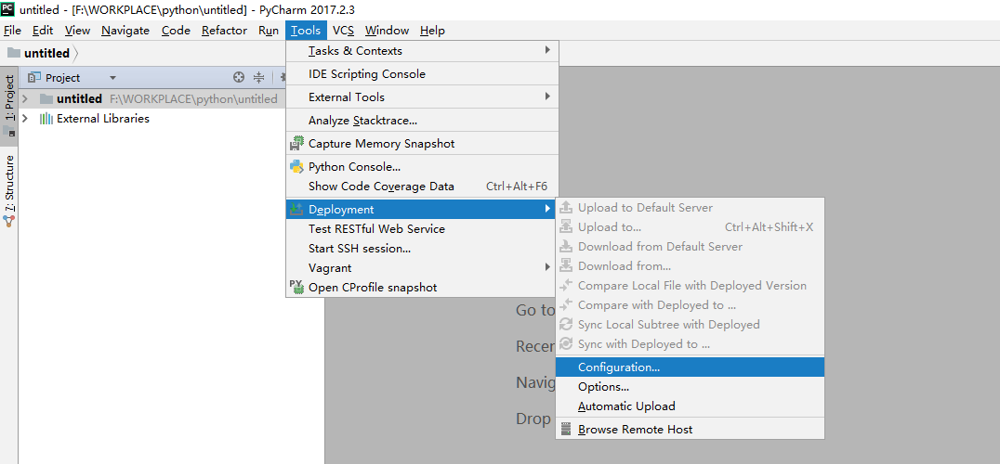
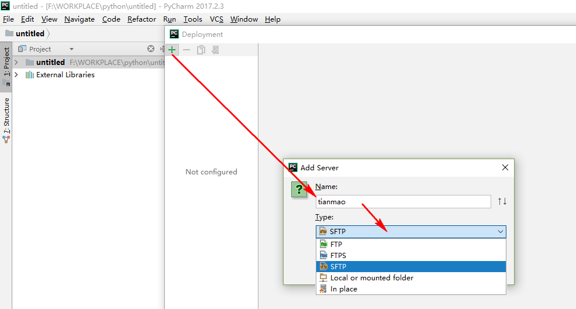
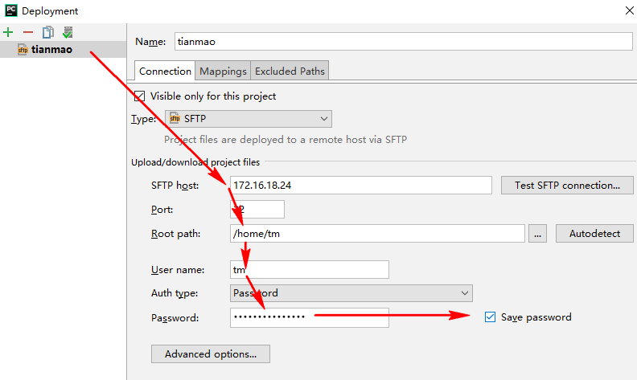
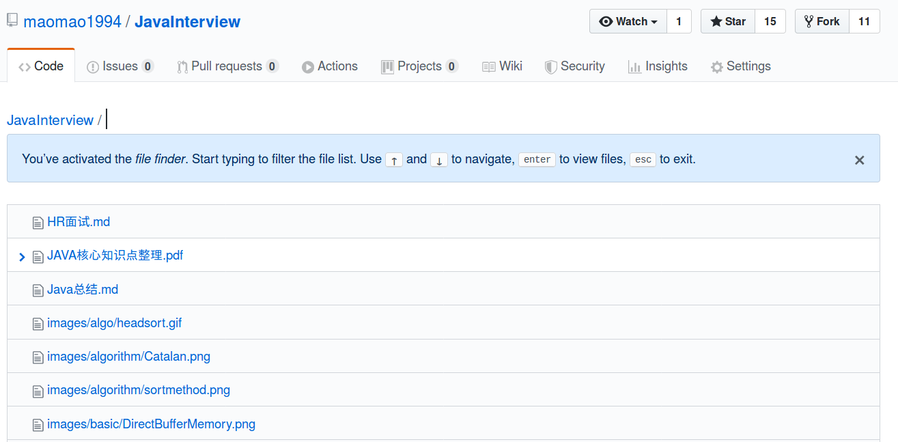
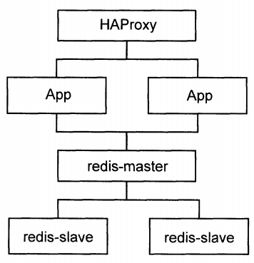
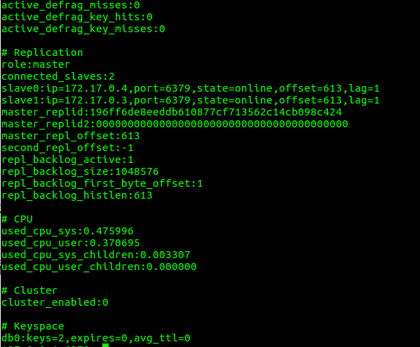
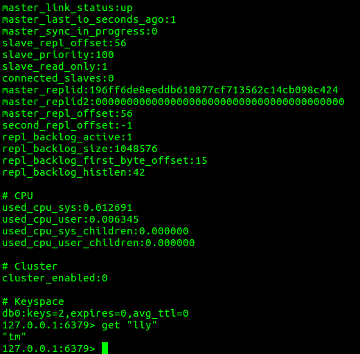
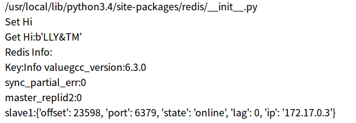
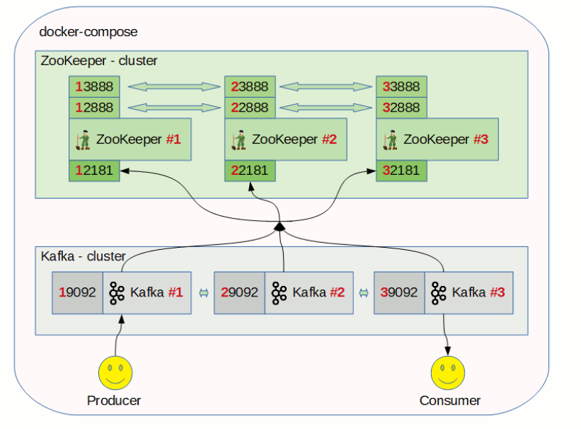

记录开发工具的使用

<!--more-->

## pycharm配置远程interpreter

### 配置SFTP






### 配置Interpreter


### 部署代码


### 执行

## 设置putty以查看TensorBoard

我的单机计算资源有限，所以选择在服务器上训练tensorflow模型。为了在本地机器的浏览器上查看Tensorboard，进行以下操作：

主要就是使用putty建立端口映射：


使用putty登陆服务器，使用以下命令启动tensorboard：

```
tensorboard --log . --port 16011
```


在本地浏览器中输入：localhost:16010即可访问tensorboard.


## IDEA插件编写

### 选取单词右键有道翻译

- 效果

  - 选取单词右键

  

  - 翻译结果

  

- 代码

  - 主程序

    ```Java
    package com.mao.arthasplugin;
    
    import com.intellij.openapi.actionSystem.AnAction;
    import com.intellij.openapi.actionSystem.AnActionEvent;
    import com.intellij.openapi.actionSystem.PlatformDataKeys;
    import com.intellij.openapi.application.ApplicationManager;
    import com.intellij.openapi.editor.Editor;
    import com.intellij.openapi.editor.SelectionModel;
    import com.intellij.openapi.ui.Messages;
    import com.intellij.openapi.ui.popup.Balloon;
    import com.intellij.openapi.ui.popup.JBPopupFactory;
    import com.intellij.ui.JBColor;
    import org.apache.http.util.TextUtils;
    
    import org.apache.http.HttpEntity;
    import org.apache.http.NameValuePair;
    import org.apache.http.client.entity.UrlEncodedFormEntity;
    import org.apache.http.client.methods.CloseableHttpResponse;
    import org.apache.http.client.methods.HttpPost;
    import org.apache.http.impl.client.CloseableHttpClient;
    import org.apache.http.impl.client.HttpClients;
    import org.apache.http.message.BasicNameValuePair;
    import org.apache.http.util.EntityUtils;
    import org.json.JSONArray;
    import org.json.JSONException;
    import org.json.JSONObject;
    
    import java.io.*;
    import java.nio.charset.StandardCharsets;
    import java.security.MessageDigest;
    import java.security.NoSuchAlgorithmException;
    import java.util.*;
    import java.awt.*;
    import java.util.List;
    
    /**
     * @Author MaoTian
     * @Classname Translation
     * @Description IDEA翻译插件
     * @Date 上午10:24 2019/11/1
     * @Version 1.0
     * @Created by mao<tianmao818@qq.com>
     */
    public class Translation extends AnAction {
    
        @Override
        public void actionPerformed(AnActionEvent e) {
            final Editor mEditor = e.getData(PlatformDataKeys.EDITOR);
            if (null == mEditor) {
                return;
            }
            SelectionModel model = mEditor.getSelectionModel();
            final String selectedText = model.getSelectedText();
            if (TextUtils.isEmpty(selectedText)) {
                return;
            }
            Translate translate=new Translate();
            String result="";
            try {
                result=translate.translate(selectedText);
            } catch (IOException ex) {
                ex.printStackTrace();
            }
            showPopupBalloon(mEditor, result);
    
        }
        private void showPopupBalloon(final Editor editor, final String result) {
            ApplicationManager.getApplication().invokeLater(new Runnable() {
                public void run() {
                    JBPopupFactory factory = JBPopupFactory.getInstance();
                    factory.createHtmlTextBalloonBuilder(result, null, new JBColor(new Color(186, 238, 186), new Color(73, 117, 73)), null)
                            .setFadeoutTime(5000)
                            .createBalloon()
                            .show(factory.guessBestPopupLocation(editor), Balloon.Position.below);
                }
            });
        }
    }
    
    class Translate {
    
        private static final String YOUDAO_URL = "https://openapi.youdao.com/api";
        private static final String APP_KEY = "你申请的key";
        private static final String APP_SECRET = "你申请的key";
    
        public String translate(String q) throws IOException {
    
            Map<String,String> params = new HashMap<String,String>();
            String salt = String.valueOf(System.currentTimeMillis());
            params.put("from", "en");
            params.put("to", "zh-CHS");
            params.put("signType", "v3");
            String curtime = String.valueOf(System.currentTimeMillis() / 1000);
            params.put("curtime", curtime);
            String signStr = APP_KEY + truncate(q) + salt + curtime + APP_SECRET;
            String sign = getDigest(signStr);
            params.put("appKey", APP_KEY);
            params.put("q", q);
            params.put("salt", salt);
            params.put("sign", sign);
            /** 处理结果 */
            return requestForHttp(YOUDAO_URL,params);
        }
    
        public String requestForHttp(String url,Map<String,String> params) throws IOException {
    
            /** 创建HttpClient */
            CloseableHttpClient httpClient = HttpClients.createDefault();
    
            /** httpPost */
            HttpPost httpPost = new HttpPost(url);
            List<NameValuePair> paramsList = new ArrayList<NameValuePair>();
            Iterator<Map.Entry<String,String>> it = params.entrySet().iterator();
            while(it.hasNext()){
                Map.Entry<String,String> en = it.next();
                String key = en.getKey();
                String value = en.getValue();
                paramsList.add(new BasicNameValuePair(key,value));
            }
            httpPost.setEntity(new UrlEncodedFormEntity(paramsList,"UTF-8"));
            CloseableHttpResponse httpResponse = httpClient.execute(httpPost);
            String out="";
            try{
                HttpEntity httpEntity = httpResponse.getEntity();
                String json = EntityUtils.toString(httpEntity,"UTF-8");
    
                //解析结果
                JSONObject object=new JSONObject(json).getJSONObject("basic");
                JSONArray array=object.getJSONArray("explains");
                for(int i=0;i<array.length();i++){
                    out+=i+":  "+array.get(i)+"\n";
                }
            } catch (JSONException e) {
                e.printStackTrace();
            } finally {
                try{
                    if(httpResponse!=null){
                        httpResponse.close();
                    }
                }catch(IOException e){
                }
            }
            return out;
        }
    
        /**
         * 生成加密字段
         */
        public static String getDigest(String string) {
            if (string == null) {
                return null;
            }
            char hexDigits[] = {'0', '1', '2', '3', '4', '5', '6', '7', '8', '9', 'A', 'B', 'C', 'D', 'E', 'F'};
            byte[] btInput = string.getBytes(StandardCharsets.UTF_8);
            try {
                MessageDigest mdInst = MessageDigest.getInstance("SHA-256");
                mdInst.update(btInput);
                byte[] md = mdInst.digest();
                int j = md.length;
                char str[] = new char[j * 2];
                int k = 0;
                for (byte byte0 : md) {
                    str[k++] = hexDigits[byte0 >>> 4 & 0xf];
                    str[k++] = hexDigits[byte0 & 0xf];
                }
                return new String(str);
            } catch (NoSuchAlgorithmException e) {
                return null;
            }
        }
    
        public static String truncate(String q) {
            if (q == null) {
                return null;
            }
            int len = q.length();
            return len <= 20 ? q : (q.substring(0, 10) + len + q.substring(len - 10, len));
        }
    }
    
    ```

  - 配置plugin.xml

    ```xml
      <actions>
            <!-- Add your actions here -->
            <action id="TestTranslation.Translation" class="com.mao.arthasplugin.Translation" text="Translate"
                    description="my first plugin">
                <add-to-group group-id="EditorPopupMenu" anchor="first"/>
                <keyboard-shortcut keymap="$default" first-keystroke="ctrl alt A"/>
            </action>
        </actions>
    ```

## git的使用

### 忽略push的文件

```sh
# 编写gitignore文件，注意项目路径的写法，不要使用“./文件夹”表示从当前开始，直接就是“文件夹即可”
git rm -r --cached .
git add .
git commit -m 'update .gitignore'
```

### 分支相关

#### 创建并切换到新分支

```sh
git checkout -b panda
```

#### 查看本地分支

```sh
git branch
```

#### 查看分支结构图

```sh
git log --graph 
git log --decorate 
git log --oneline 
git log --simplify-by-decoration 
git log --all
git log --help
```

#### 将develop分支merge到master分支

```sh
git add .
git commit -m ''
git push
git checkout master
# checkout不成功可能需要执行git stash命令
git merge develop //将develop 分支与master分支合并
git push //将合并的本地master分支推送到远程master
```

### github相关

#### 条件检索

```sh
xxx in:name,readme,description
```

#### 搜索  t



#### 高亮代码

```sh
高亮1行,地址后面紧跟#L数字:代码地址#L13第十三行高亮
高亮多行,地址后面紧跟#L数字-L数字2:代码地址#L13-L20高亮13到20行
```

#### 拉取指定分区

```sh
git add test.txt       # add 文件到暂存区
git commit -m"first commit for init"   # 提交到本地版本库
git branch -a    #此时，可以看见本地和远程所有的分支信息
git branch  dev   #本地建立一个分支
git branch --set-upstream-to=origin/dev dev    #将远程分支dev和本地分支dev关联
git pull
```


## cloudera常用命令

升级jdk,直接rm掉以前的jdk,修改`/etc/profile`,关闭服务后重启

```sh
# 关闭服务
service cloudera-scm-agent stop
service cloudera-scm-server stop
```

```sh
service hadoop-hdfs-datanode stop
service hadoop-hdfs-journalnode stop
service hadoop-hdfs-namenode stop
service hadoop-hdfs-secondarynamenode stop
service hadoop-httpfs stop
service hadoop-mapreduce-historyserver stop
service hadoop-yarn-nodemanager stop
service hadoop-yarn-proxyserver stop
service hadoop-yarn-resourcemanager stop
service hbase-master stop
service hbase-regionserver stop
service hbase-rest stop
service hbase-solr-indexer stop
service hbase-thrift stop
service hive-metastore stop
service hive-server2 stop
service impala-catalog stop
service impala-server stop
service impala-state-store stop
service oozie stop
service solr-server stop
service spark-history-server stop
service sqoop2-server stop
service sqoop-metastore stop
service zookeeper-server stop
```

```sh
# 重启
service cloudera-scm-agent start
service cloudera-scm-server start
# ps:重启后,需要等待一定时间,等待服务全部启动以后使用
```

## Docker使用

### Docker常用命令及tips

- 查看和宿主机器共享文件夹

- 启动容器

  ```sh
  docker run命令来启动容器
  ```

- 启动容器(启动已经存在的容器)

  ```sh
  docker start cdh
  ```

- 进入容器

  ```sh
  docker exec -it cdh /bin/bash
  ```

- 向docker容器中复制文件

  ```sh
  docker cp '/home/mao/jdk-8u201-linux-x64.tar.gz' cdh:/home
  ```

### 搭建我的第一个Docker应用栈

#### 概述

我搭建的这个Docker应用栈的结构如下图所示,我主要参考的是浙江大学SEL实验室出版的 "Docker容器与容器云 第二版",由于版本的关系,书中的一些例子在这里不能够完全实验,尤其是一些配置文件的编写存在着差异.

我们使用的软件的版本信息如下表所示:

| 软件名  | 版本             |
| ------- | ---------------- |
| HAProxy | 1.9.0 2018/12/19 |
| Redis   | 5.0.3            |
| Django  | 1.10.4           |

#### 镜像和容器

```sh
# 拉取镜像
sudo docker pull ubuntu
sudo docker pull django 
sudo docker pull haproxy
sudo docker pull redis
# 查看镜像
sudo docker images
```

```
# 启动redis容器
sudo docker run -it --name redis-master redis /bin/bash
# 将redis-master改名为master,启动后在/etc/hosts中会加入master的IP
sudo docker run -it --name redis-slave1 --link redis-master:master redis /bin/bash
sudo docker run -it --name redis-slave2 --link redis-master:master redis /bin/bash
# 启动Django容器
sudo docker run -it --name APP1 --link redis-master:db -v ~/Projects/Django/APP1:/usr/src/app django /bin/bash
sudo docker run -it --name APP2 --link redis-master:db -v ~/Projects/Django/APP2:/usr/src/app django /bin/bash

# 启动HAProxy容器
sudo docker run -it --name HAProxy --link APP1:APP1 --link APP2:APP2 -p 6301:6301 -v ~/Projects/HAProxy:/tmp haproxy /bin/bash
# 查看挂载的volume信息
sudo docker inspect  "ID" grep "volume"
# 查看IP
sudo docker inspect 4267e591b78e
```

#### 修改Redis配置文件(模板首先从官网获取)

修改配置文件,在模板文件中检索以下的信息,并作修改.

- master对应的修改

```
daemonize yes
pidfile /var/run/redis.pid
# 必须绑定自身的ip,否则slave节点无法连接
bind 127.0.0.1 172.17.2
```

- slave节点的修改

```
daemonize yes
pidfile /var/run/redis.pid
replicaof master 6397
```

#### 启动redis节点

使用redis-server+配置文件启动主节点,使用redis-cli客户端来操作,通过info命令来查看启动之后的信息,可见:连接上的slave节点有两个.

在master节点上set一个消息,key是"lly",value是"tm",通过key可以拿到value的值.

在slave节点上使用redis-cli指令启动客户端,使用info查看节点的信息,可见:当前的master_link_status已经up起来了,之前,我在master的配置文件中没有绑定IP,导致这个状态一直是down,也算是一个大坑,在坑里待了半天.在redis-cli中使用get key来获取value(可见,master已经replica一份给slave节点了)


#### Django

- 建立工程

```
# 在容器中
cd /usr/src/app
mkdir dockerweb
cd dockerweb
django-admin.py startproject redisweb
cd redisweb
python manage.py startapp helloworld
```

- 在宿主机器上,编写代码:以下的两段代码大致相同,功能就是往redis中写入键值对,请求不同的APP将会返回不同的页面.

```python
# APP1
from django.shortcuts import render
from django.http import HttpResponse
# Create your views here.
import redis
def hello(request):
    str=redis.__file__
    str+="<br>"
    r=redis.Redis(host='db',port=6379,db=0)
    info=r.info()
    str+=("Set Hi<br>")
    r.set("LLY","LLY&TM")
    str+=("Get Hi:%s<br>"%r.get('LLY'))
    str+=("Redis Info:<br>")
    str+=("Key:Info value")
    for key in info:
        str+=("%s:%s<br>"%(key,info[key]))
    return HttpResponse(str)
# APP2
from django.shortcuts import render
from django.http import HttpResponse
# Create your views here.
import redis
def hello(request):
    str=redis.__file__
    str+="<br>"
    r=redis.Redis(host='db',port=6379,db=0)
    info=r.info()
    str+=("Set Hi<br>")
    r.set("TM","TM&LLY")
    str+=("Get Hi:%s<br>"%r.get('TM'))
    str+=("Redis Info:<br>")
    str+=("Key:Info value")
    for key in info:
        str+=("%s:%s<br>"%(key,info[key]))
    return HttpResponse(str)
```

- 配置文件的修改:

```python
# setting.py的修改,添加helloworld
INSTALLED_APPS = [
    'django.contrib.admin',
    'django.contrib.auth',
    'django.contrib.contenttypes',
    'django.contrib.sessions',
    'django.contrib.messages',
    'django.contrib.staticfiles',
    'helloworld',
]
```

```python
# urls.py的修改
from django.conf.urls import url
from django.contrib import admin
from helloworld.views import hello
urlpatterns = [
    url(r'^admin/', admin.site.urls),
    url(r'^helloworld$',hello)
]
```

- 以上操作完成以后,在目录/usr/src/app/dockerweb/redisweb 下分别执行:

```sh
python manage.py makemigrations
python manage.py migrate
```


#### HAProxy

对于HAProxy的配置参考[这里](https://blog.csdn.net/king_kgh/article/details/75599083) 
我们最终编写的配置文件如下,执行操作`haproxy -f haproxy.cfg`

```
global
    log 127.0.0.1 local0
    maxconn 4096
    chroot /usr/local/sbin
    daemon
    nbproc 4
    pidfile /usr/local/sbin/haproxy.pid

defaults
    log 127.0.0.1 local3
    mode http
    option dontlognull
    option redispatch
    retries 2
    maxconn 2000
    balance roundrobin
    
    timeout connect 5000ms
    timeout client 50000ms
    timeout server 50000ms

listen status
    bind 0.0.0.0:6301
    stats enable
    stats uri /haproxy-stats
        server APP1 APP1:8001 check inter 2000 rise 2 fall 5
        server APP2 APP2:8002 check inter 2000 rise 2 fall 5
listen admin_status
    bind 0.0.0.0:32795
    mode http
    stats uri /haproxy
    stats realm Global\ statistics
    stats auth admin:admin
```

#### 终极结果

我在浏览器中访问同一个地址"http://172.17.0.8:6301/helloworld", 快速刷新页面,将会得到不同的页面效果,也就是说返回的可能源自APP1,也可能源自APP2.

- 源自APP1:
  
- 源自APP2
  
- 通过HAProxy管理界面查看,访问地址"http://172.17.0.8:32795/haproxy"
  

### 使用Docker搭建kafka集群

#### 通过docker-compose创建集群

- 架构

  

- docker-compose.yml文件

```yml
version: '2'
services:
  zookeeper-1:
    image: confluentinc/cp-zookeeper:latest
    hostname: zookeeper-1
    ports:
      - "12181:12181"
    environment:
      ZOOKEEPER_SERVER_ID: 1
      ZOOKEEPER_CLIENT_PORT: 12181
      ZOOKEEPER_TICK_TIME: 2000
      ZOOKEEPER_INIT_LIMIT: 5
      ZOOKEEPER_SYNC_LIMIT: 2
      ZOOKEEPER_SERVERS: zookeeper-1:12888:13888;zookeeper-2:22888:23888;zookeeper-3:32888:33888

  zookeeper-2:
    image: confluentinc/cp-zookeeper:latest
    hostname: zookeeper-2
    ports:
      - "22181:22181"
    environment:
      ZOOKEEPER_SERVER_ID: 2
      ZOOKEEPER_CLIENT_PORT: 22181
      ZOOKEEPER_TICK_TIME: 2000
      ZOOKEEPER_INIT_LIMIT: 5
      ZOOKEEPER_SYNC_LIMIT: 2
      ZOOKEEPER_SERVERS: zookeeper-1:12888:13888;zookeeper-2:22888:23888;zookeeper-3:32888:33888

  zookeeper-3:
    image: confluentinc/cp-zookeeper:latest
    hostname: zookeeper-3
    ports:
      - "32181:32181"
    environment:
      ZOOKEEPER_SERVER_ID: 3
      ZOOKEEPER_CLIENT_PORT: 32181
      ZOOKEEPER_TICK_TIME: 2000
      ZOOKEEPER_INIT_LIMIT: 5
      ZOOKEEPER_SYNC_LIMIT: 2
      ZOOKEEPER_SERVERS: zookeeper-1:12888:13888;zookeeper-2:22888:23888;zookeeper-3:32888:33888

  kafka-1:
    image: confluentinc/cp-kafka:latest
    hostname: kafka-1
    ports:
      - "19092:19092"
    depends_on:
      - zookeeper-1
      - zookeeper-2
      - zookeeper-3
    environment:
      KAFKA_BROKER_ID: 1
      KAFKA_ZOOKEEPER_CONNECT: zookeeper-1:12181,zookeeper-2:12181,zookeeper-3:12181
      KAFKA_ADVERTISED_LISTENERS: PLAINTEXT://kafka-1:19092
 
  kafka-2:
    image: confluentinc/cp-kafka:latest
    hostname: kafka-2
    ports:
      - "29092:29092"
    depends_on:
      - zookeeper-1
      - zookeeper-2
      - zookeeper-3
    environment:
      KAFKA_BROKER_ID: 2
      KAFKA_ZOOKEEPER_CONNECT: zookeeper-1:12181,zookeeper-2:12181,zookeeper-3:12181
      KAFKA_ADVERTISED_LISTENERS: PLAINTEXT://kafka-2:29092
 
  kafka-3:
    image: confluentinc/cp-kafka:latest
    hostname: kafka-3
    ports:
      - "39092:39092"
    depends_on:
      - zookeeper-1
      - zookeeper-2
      - zookeeper-3
    environment:
      KAFKA_BROKER_ID: 3
      KAFKA_ZOOKEEPER_CONNECT: zookeeper-1:12181,zookeeper-2:12181,zookeeper-3:12181
      KAFKA_ADVERTISED_LISTENERS: PLAINTEXT://kafka-3:39092
```

- 启动

  ```sh
  docker-compose up
  ```

  

#### 安装客户端工具

```sh
sudo apt-get install kafkacat
```

#### 测试

- 修改客户端的hosts,添加kafka节点的ip信息

  ```
  172.20.0.6          kafka-1
  172.20.0.5          kafka-2
  172.20.0.7          kafka-3
  ```

- 查看集群的信息

  ```sh
  kafkacat -L -b kafka-1:19092
  ```

  

- 查看zookeeper信息

  ```sh
  zookeeper-shell 127.0.0.1:12181
  ls /
  
  #查看broker的id
  ls /brokers/ids
  
  #查看消息
  ls /brokers/topics
  
  #查看broker的信息
  get /brokers/ids/0
  ```

  

- 开启producer

  

- 开启consumer

  